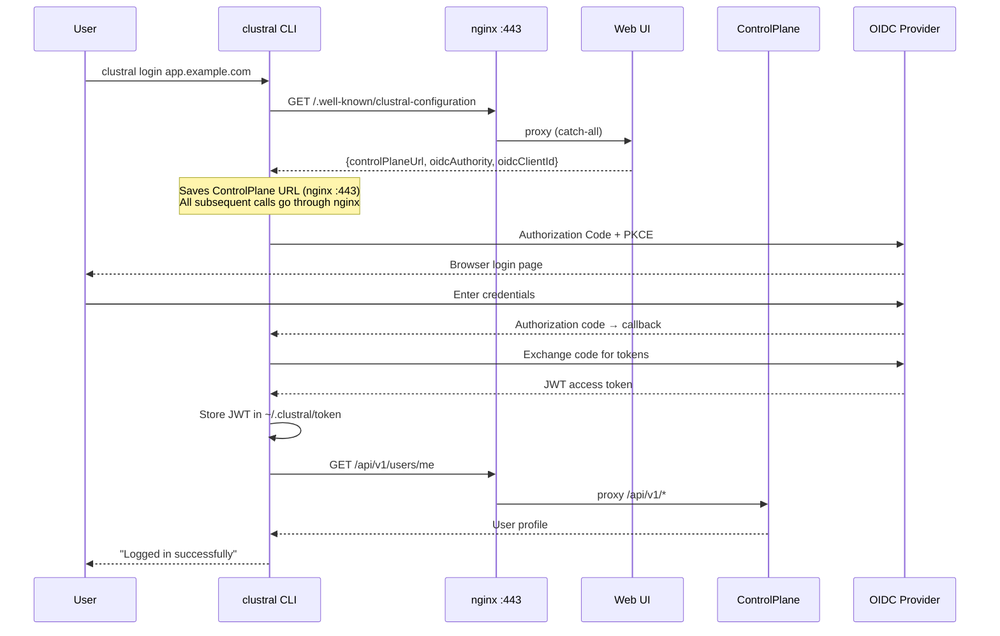
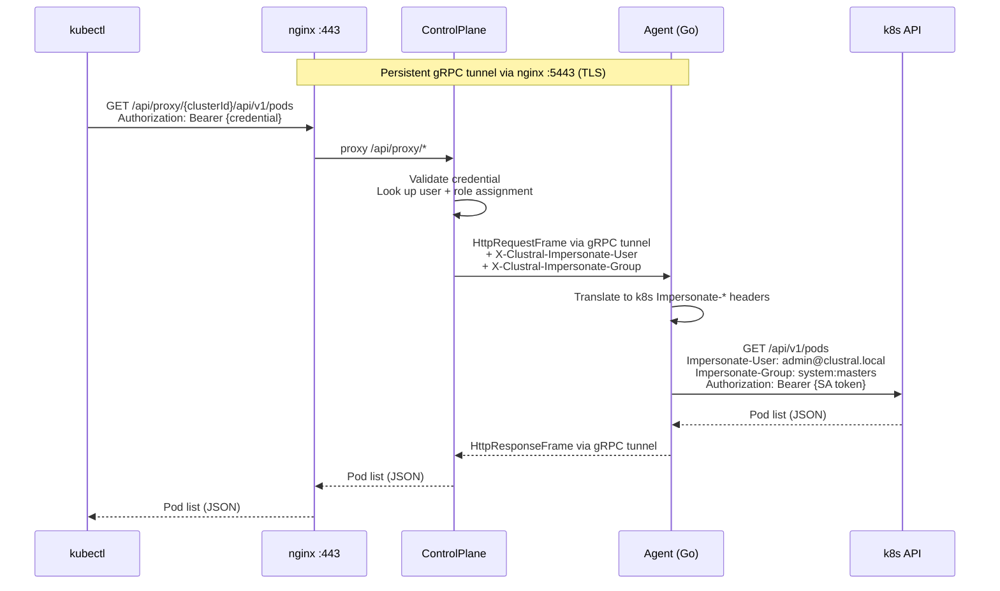
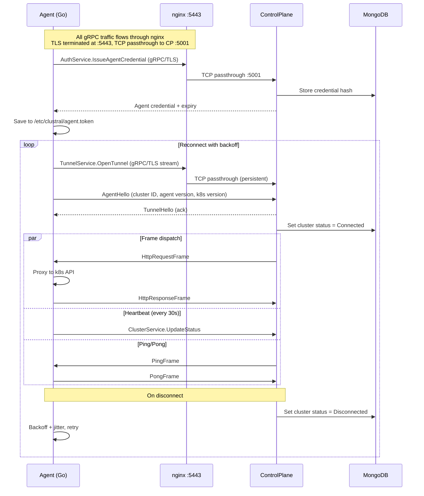
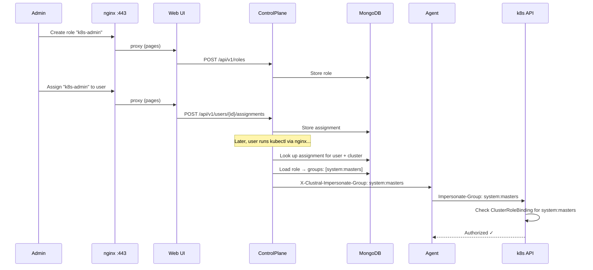
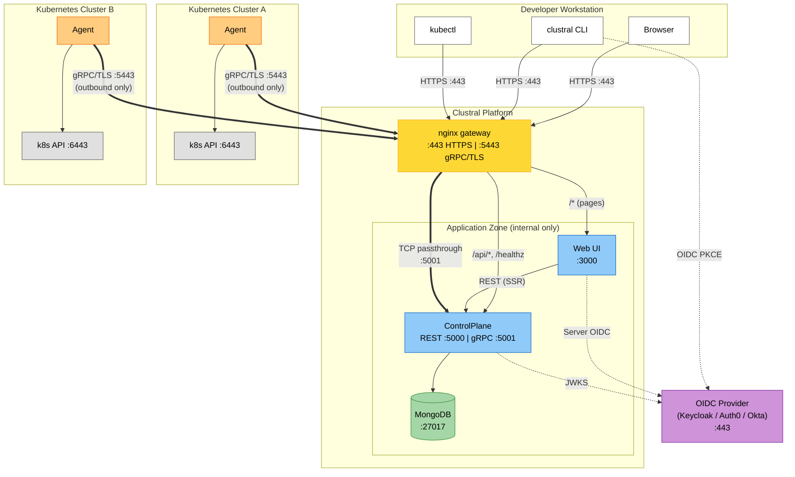
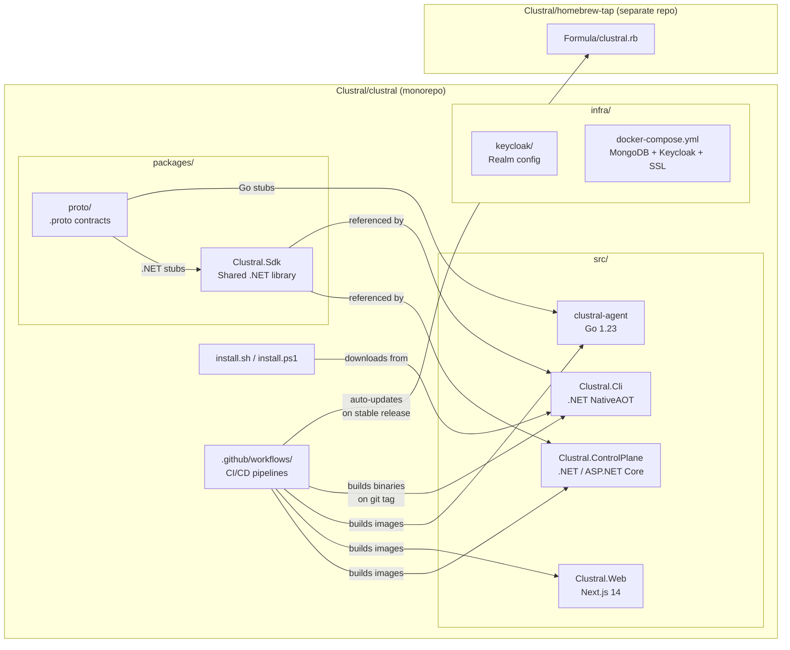
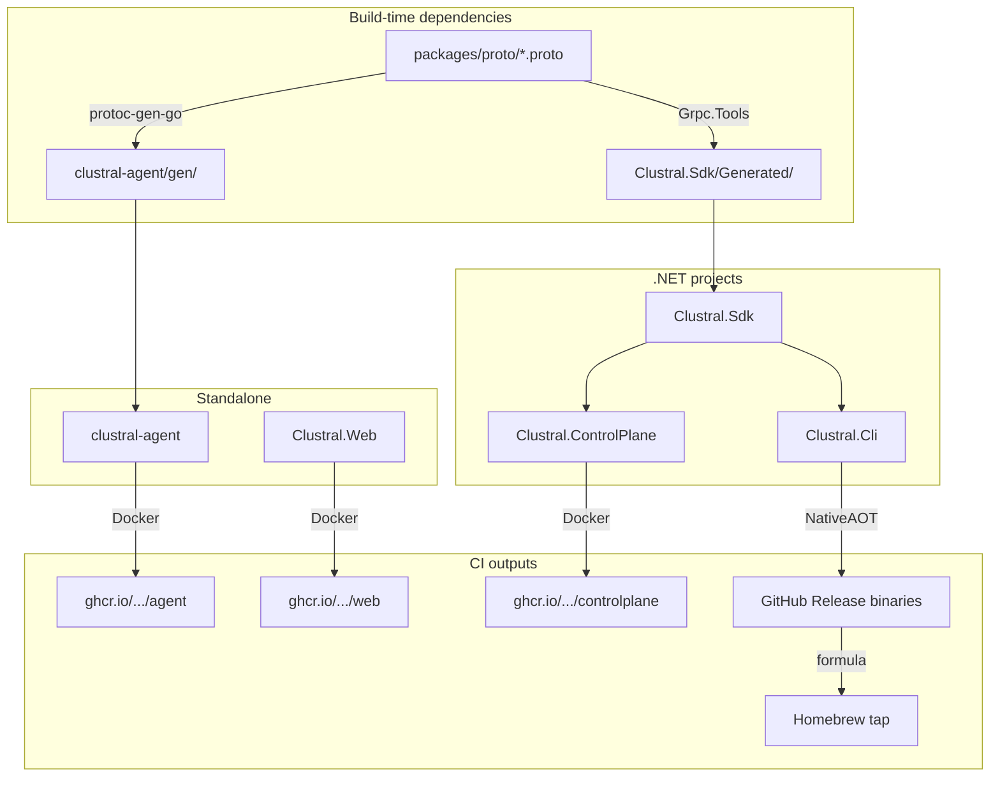
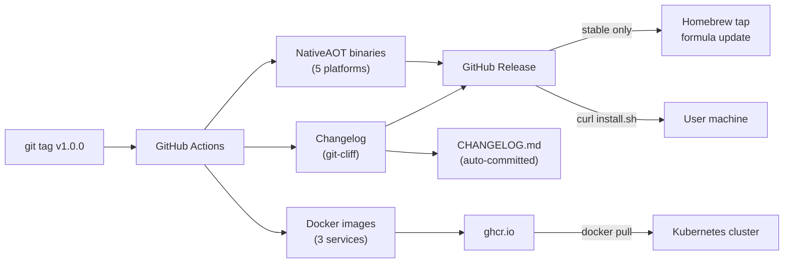

# Clustral

[](https://github.com/Clustral/clustral/actions/workflows/build.yml)
[](https://github.com/Clustral/clustral/actions/workflows/release-cli.yml)
[](https://github.com/Clustral/clustral/actions/workflows/release.yml)
[](https://github.com/Clustral/clustral/releases)
[](LICENSE)
[](https://dotnet.microsoft.com/)
[](https://go.dev/)
[](https://nextjs.org/)

Kubernetes access proxy — a Teleport alternative built on .NET, Go and React.

Clustral lets users authenticate via any OIDC provider (Keycloak, Auth0, Okta, Azure AD), then transparently proxies `kubectl` traffic through a control plane to registered cluster agents. No inbound firewall rules required on the cluster side.

## Architecture

```mermaid
graph TB
    subgraph Developer
        CLI[clustral CLI]
        KB[kubectl]
    end

    subgraph "Clustral Platform"
        NGX[nginx gateway<br/>:443 HTTPS / :5443 gRPC-TLS]
        WEB[Web UI<br/>Next.js 14]
        CP[ControlPlane<br/>ASP.NET Core]
        DB[(MongoDB)]
    end

    OIDC[OIDC Provider<br/>Keycloak / Auth0 / Okta]

    subgraph "Target Cluster"
        AGENT[Agent<br/>Go binary]
        K8S[k8s API Server]
    end

    CLI -.->|".well-known discovery"| NGX
    CLI -->|REST + kubectl proxy| NGX
    KB -->|kubectl proxy| NGX
    NGX -->|"/api/*, /healthz"| CP
    NGX -->|"/*"| WEB
    CLI -->|OIDC PKCE| OIDC
    WEB -->|Server-side OIDC| OIDC
    WEB -->|REST (SSR)| CP
    CP --> DB
    AGENT ==>|"gRPC tunnel<br/>(outbound TLS :5443)"| NGX
    NGX -->|"TCP passthrough"| CP
    AGENT -->|Impersonate-User<br/>Impersonate-Group| K8S
```

| Component        | Stack                                       | Description                                     |
|------------------|---------------------------------------------|-------------------------------------------------|
| **nginx**        | nginx 1.27                                  | Unified gateway — TLS termination, routing      |
| **Web**          | Next.js 14, React 18, TypeScript, Tailwind  | Dashboard, server-side OIDC via NextAuth        |
| **ControlPlane** | ASP.NET Core, MongoDB                       | REST + gRPC server, kubectl tunnel proxy        |
| **Agent**        | Go 1.23, gRPC, 16MB static binary           | Deployed per cluster, tunnels kubectl traffic   |
| **CLI**          | .NET NativeAOT, System.CommandLine          | `clustral login` / `clustral kube login`        |

## How It Works

Clustral provides secure, tunneled `kubectl` access to Kubernetes clusters without requiring inbound firewall rules, VPNs, or bastion hosts.

### Authentication Flow



### kubectl Proxy Flow



### Agent Tunnel Lifecycle



### Role-Based Access Management



### Security Model

| Layer | Mechanism |
|---|---|
| External → nginx | TLS termination on :443 (HTTPS) and :5443 (gRPC/TLS) |
| User → ControlPlane | OIDC JWT (from any provider), routed through nginx |
| kubectl → ControlPlane | Short-lived bearer token (SHA-256 hashed, never stored raw), via nginx :443 |
| Agent → ControlPlane | Long-lived agent credential (issued via bootstrap token, rotatable), via nginx :5443 |
| Agent → k8s API | In-cluster ServiceAccount token + k8s Impersonation API |
| Tunnel transport | gRPC over TLS via nginx L4 TCP passthrough (no HTTP/2 parsing) |
| Agent connectivity | Outbound only — no inbound firewall rules needed |
| Per-user k8s access | Role assignments with k8s group impersonation (system:masters, etc.) |
| Proxy rate limiting | Per-credential token bucket (100 QPS sustained, 200 burst) |

### Network Map



#### Port Reference

| Component | Port | Protocol | Direction | Description |
|---|---|---|---|---|
| **nginx HTTPS** | 443 | HTTPS | Inbound | TLS termination — REST, kubectl proxy, Web UI |
| **nginx gRPC (TLS)** | 5443 | gRPC/TLS | Inbound | L4 TCP passthrough — agent tunnel, credential auth |
| **nginx gRPC (dev)** | 5444 | gRPC | Inbound | L4 TCP passthrough — plaintext for local dev |
| **ControlPlane REST** | 5000 | HTTP/1.1 | Internal | REST API (proxied by nginx) |
| **ControlPlane gRPC** | 5001 | HTTP/2 | Internal | gRPC services (proxied by nginx) |
| **Web UI** | 3000 | HTTP | Internal | Next.js dashboard (proxied by nginx) |
| **MongoDB** | 27017 | TCP | Internal | Database (never exposed publicly) |
| **OIDC Provider** | 8080/443 | HTTPS | Varies | Keycloak, Auth0, Okta — browser + server flows |
| **Agent → nginx** | 5443 | gRPC/TLS | **Outbound only** | No inbound rules needed on cluster side |
| **Agent → k8s API** | 6443 | HTTPS | In-cluster | ServiceAccount token + impersonation headers |

#### nginx Routing

| Port | Path | Destination | Purpose |
|---|---|---|---|
| `:443` | `/api/v1/*` | ControlPlane `:5000` | REST API (CLI, browser) |
| `:443` | `/api/proxy/*` | ControlPlane `:5000` | kubectl tunnel proxy |
| `:443` | `/healthz*` | ControlPlane `:5000` | Health checks |
| `:443` | `/*` | Web UI `:3000` | Dashboard, NextAuth, CLI discovery |
| `:5443` | *(L4 TCP passthrough)* | ControlPlane `:5001` | All gRPC over TLS: tunnel, heartbeat, auth |
| `:5444` | *(L4 TCP passthrough)* | ControlPlane `:5001` | All gRPC plaintext (local dev only) |

#### Network Requirements

- **Agents connect outbound** to the nginx gRPC port (`:5443`) — no inbound firewall rules, VPNs, or bastion hosts needed on the cluster side
- **ControlPlane and Web UI are internal only** — not exposed publicly; nginx handles all external traffic
- **MongoDB** must never be exposed outside the application zone
- **TLS** is required in production for all external traffic (nginx terminates TLS on both `:443` and `:5443`)
- **OIDC provider** must be reachable from the browser (PKCE flow), the Web UI server (token exchange), and the ControlPlane (JWKS key fetch)
- **kubectl traffic** flows: kubectl → nginx `:443` → ControlPlane → gRPC tunnel → Agent → k8s API

### Proxy Configuration

The kubectl proxy is configurable via the `Proxy` section in `appsettings.json`:

```json
{
  "Proxy": {
    "TunnelTimeout": "00:02:00",
    "RateLimiting": {
      "Enabled": true,
      "BurstSize": 200,
      "RequestsPerSecond": 100,
      "QueueSize": 50
    }
  }
}
```

| Setting | Default | Description |
|---|---|---|
| `TunnelTimeout` | 2 min | Max wait for agent response (504 on timeout) |
| `RateLimiting:Enabled` | `true` | Toggle per-credential rate limiting |
| `RateLimiting:BurstSize` | `200` | Token bucket capacity (matches k8s client-go) |
| `RateLimiting:RequestsPerSecond` | `100` | Sustained QPS per credential |
| `RateLimiting:QueueSize` | `50` | Queued requests before 429 |

Rate limiting protects the ControlPlane and tunnel from abuse. Request body size and API timeouts are left to the k8s API server.

### Token Lifecycle

```
Bootstrap token (one-time, from registration)
  → exchanged for agent credential (1 year, rotatable)
    → agent uses it to open gRPC tunnel

OIDC JWT (short-lived, from Keycloak/Auth0/etc.)
  → exchanged for kubeconfig credential (8 hours default, configurable)
    → used by kubectl to authenticate proxy requests
    → revoked on logout
```

## Quick Start (On-Prem)

Deploy the full stack from pre-built images.

### 1. Create `docker-compose.yml`

```yaml
services:
  mongo:
    image: mongo:8
    restart: unless-stopped
    volumes:
      - mongo_data:/data/db
    healthcheck:
      test: ["CMD", "mongosh", "--eval", "db.adminCommand('ping')"]
      interval: 5s
      timeout: 5s
      retries: 10

  keycloak:
    image: quay.io/keycloak/keycloak:24.0
    restart: unless-stopped
    command: start-dev --import-realm
    environment:
      KEYCLOAK_ADMIN: admin
      KEYCLOAK_ADMIN_PASSWORD: admin
      KC_HTTP_PORT: 8080
      KC_HOSTNAME_STRICT: "false"
    ports:
      - "8080:8080"
    volumes:
      - ./keycloak:/opt/keycloak/data/import:ro
    healthcheck:
      test: ["CMD-SHELL", "exec 3<>/dev/tcp/localhost/8080 && echo -e 'GET /health/ready HTTP/1.1\\r\\nHost: localhost\\r\\nConnection: close\\r\\n\\r\\n' >&3 && head -1 <&3 | grep -q '200 OK'"]
      interval: 10s
      timeout: 10s
      retries: 30
      start_period: 60s

  controlplane:
    image: ghcr.io/clustral/clustral-controlplane:latest
    restart: unless-stopped
    depends_on:
      mongo:
        condition: service_healthy
      keycloak:
        condition: service_healthy
    environment:
      ASPNETCORE_ENVIRONMENT: Development
      ConnectionStrings__Clustral: "mongodb://mongo:27017"
      MongoDB__DatabaseName: "clustral"
      Oidc__Authority: "http://<YOUR_HOST_IP>:8080/realms/clustral"
      Oidc__MetadataAddress: "http://<YOUR_HOST_IP>:8080/realms/clustral/.well-known/openid-configuration"
      Oidc__ClientId: "clustral-control-plane"
      Oidc__Audience: "clustral-control-plane"
      Oidc__RequireHttpsMetadata: "false"
    healthcheck:
      test: ["CMD-SHELL", "curl -sf http://localhost:5000/healthz/ready || exit 1"]
      interval: 10s
      timeout: 5s
      retries: 10
      start_period: 15s

  web:
    image: ghcr.io/clustral/clustral-web:latest
    restart: unless-stopped
    depends_on:
      controlplane:
        condition: service_healthy
    environment:
      NEXTAUTH_URL: "https://<YOUR_HOST_IP>"
      CONTROLPLANE_URL: "http://controlplane:5000"
      CONTROLPLANE_PUBLIC_URL: "https://<YOUR_HOST_IP>"
      OIDC_ISSUER: "http://<YOUR_HOST_IP>:8080/realms/clustral"
      OIDC_CLIENT_ID: "clustral-web"
      OIDC_CLIENT_SECRET: "clustral-web-secret"
      AUTH_SECRET: "change-me-to-a-random-32-char-string!!"

  ssl-proxy:
    image: nginx:1.27-alpine
    restart: unless-stopped
    depends_on:
      controlplane:
        condition: service_healthy
    ports:
      - "443:443"
      - "5443:5443"
    volumes:
      - ./nginx/nginx.conf:/etc/nginx/conf.d/default.conf:ro
      - certs:/etc/nginx/certs
    entrypoint: /bin/sh
    command:
      - -c
      - |
        if [ ! -f /etc/nginx/certs/tls.crt ]; then
          apk add --no-cache openssl > /dev/null 2>&1
          openssl req -x509 -nodes -days 365 \
            -newkey rsa:2048 \
            -keyout /etc/nginx/certs/tls.key \
            -out /etc/nginx/certs/tls.crt \
            -subj "/CN=clustral" \
            -addext "subjectAltName=DNS:clustral,DNS:localhost,IP:0.0.0.0" \
            2>/dev/null
        fi
        exec nginx -g "daemon off;"

volumes:
  mongo_data:
  certs:
```

> Replace `<YOUR_HOST_IP>` with your machine's IP address. All services must use the same IP so the browser, Next.js server, and ControlPlane can all reach Keycloak at the same issuer URL.

### 2. Download the Keycloak realm config

```bash
mkdir -p keycloak
curl -sL https://raw.githubusercontent.com/Clustral/clustral/main/infra/keycloak/clustral-realm.json \
  -o keycloak/clustral-realm.json
```

### 3. Start

```bash
docker compose up -d
```

### 4. Default users (Keycloak)

| Username | Password | Role             |
|----------|----------|------------------|
| `admin`  | `admin`  | `clustral-admin` |
| `dev`    | `dev`    | `clustral-user`  |

## Install the CLI

### macOS / Linux (one-liner)

```bash
curl -sL https://raw.githubusercontent.com/Clustral/clustral/main/install.sh | sh
```

### macOS / Linux (Homebrew)

```bash
brew install Clustral/tap/clustral
```

### Windows (PowerShell)

```powershell
irm https://raw.githubusercontent.com/Clustral/clustral/main/install.ps1 | iex
```

### Build from source

```bash
dotnet publish src/Clustral.Cli -r osx-arm64 -c Release    # macOS Apple Silicon
dotnet publish src/Clustral.Cli -r linux-x64  -c Release    # Linux
dotnet publish src/Clustral.Cli -r win-x64    -c Release    # Windows
```

## CLI Usage

```bash
# Authenticate (shows profile if already logged in)
clustral login app.clustral.example

# Force re-authentication
clustral login --force

# Sign out — revokes credentials, removes kubeconfig contexts
clustral logout

# --- Kubernetes ---

# List available clusters for kubectl
clustral kube ls

# Connect to a cluster (writes kubeconfig)
clustral kube login <cluster-id>

# Disconnect from a cluster (removes kubeconfig entry)
clustral kube logout <cluster-id>

# kubectl works transparently
kubectl get pods -A

# --- Management ---

# List all registered clusters
clustral clusters list

# List all users
clustral users list

# List all roles
clustral roles list

# --- Access Requests ---

# Request access to a cluster
clustral access request <cluster-id> --role <role-name>

# List access requests
clustral access list

# Approve a pending access request
clustral access approve <request-id>

# Deny a pending access request
clustral access deny <request-id> --reason "not authorized"

# Revoke an active access grant
clustral access revoke <request-id>

# --- Utility ---

# Check version
clustral version

# Self-update to latest
clustral update

# Check for updates without installing
clustral update --check

# Update to pre-release
clustral update --pre
```

### Login output

```
> Profile URL:        http://app.example.com
  Logged in as:       Admin User
  Email:              admin@clustral.local
  Kubernetes:         enabled
  CLI version:        v0.1.0
  Roles:              k8s-admin
  Clusters:           production, staging
  Access:
    production               → k8s-admin
    staging                  → k8s-viewer
  Valid until:        2026-04-06 03:41:32 +0200 [valid for 3h16m]
```

## Deploy an Agent

Register a cluster in the Web UI, then deploy the Go agent to your Kubernetes cluster:

```bash
# Apply RBAC
kubectl apply -f https://raw.githubusercontent.com/Clustral/clustral/main/src/clustral-agent/k8s/serviceaccount.yaml
kubectl apply -f https://raw.githubusercontent.com/Clustral/clustral/main/src/clustral-agent/k8s/clusterrole.yaml
kubectl apply -f https://raw.githubusercontent.com/Clustral/clustral/main/src/clustral-agent/k8s/clusterrolebinding.yaml

# Create the secret (values from the UI registration step)
kubectl -n clustral create secret generic clustral-agent-config \
  --from-literal=cluster-id="<CLUSTER_ID>" \
  --from-literal=control-plane-url="https://<YOUR_HOST>:5443" \
  --from-literal=bootstrap-token="<BOOTSTRAP_TOKEN>"

# Deploy the agent
kubectl apply -f https://raw.githubusercontent.com/Clustral/clustral/main/src/clustral-agent/k8s/deployment.yaml

# Check status
kubectl -n clustral logs -f deploy/clustral-agent
```

The agent connects outbound to the nginx gRPC port (`:5443`) — no inbound firewall rules needed.

For Docker Desktop Kubernetes, use `host.docker.internal`:

```bash
--from-literal=control-plane-url="https://host.docker.internal:5443"
```

## Access Management

Clustral has a built-in role-based access management system. OIDC handles authentication, Clustral handles authorization.

### Concepts

- **Users** — synced automatically from the OIDC provider on first login
- **Roles** — define which Kubernetes groups to impersonate (e.g. `k8s-admin` → `system:masters`)
- **Assignments** — bind a user to a role for a specific cluster (per-cluster access control)

### Setup

1. Navigate to **Roles** in the Web UI and create roles:
   - `k8s-admin` with groups `system:masters` (full cluster access)
   - `k8s-viewer` with groups `clustral-viewer` (read-only)

2. Navigate to **Users**, select a user, and assign roles per cluster

3. On each target cluster, create the corresponding k8s RBAC bindings:

```bash
# Full access for the k8s-admin role
kubectl create clusterrolebinding clustral-admins \
  --clusterrole=cluster-admin --group=system:masters

# Read-only for the k8s-viewer role
kubectl create clusterrolebinding clustral-viewers \
  --clusterrole=view --group=clustral-viewer
```

### How it works

When a user runs `kubectl`, the ControlPlane looks up their role assignment for the target cluster, resolves the role's Kubernetes groups, and sends them as `Impersonate-Group` headers through the tunnel. The Go agent sets these as separate HTTP headers on the request to the k8s API server, which enforces RBAC per the impersonated identity.

Users without a role assignment for a cluster receive `403: No role assigned for this cluster`.

## Project Structure

### Monorepo map



### Dependency graph



### Repository layout

```
Clustral/clustral (monorepo)
├── src/
│   ├── Clustral.ControlPlane/   # ASP.NET Core — REST + gRPC + kubectl proxy
│   ├── clustral-agent/          # Go — gRPC tunnel + kubectl proxy (16MB binary)
│   ├── Clustral.Cli/            # .NET NativeAOT — login, kubeconfig, self-update
│   └── Clustral.Web/            # Next.js 14 — dashboard, OIDC, access management
├── packages/
│   ├── Clustral.Sdk/            # Shared .NET: TokenCache, KubeconfigWriter
│   └── proto/                   # Protobuf contracts (shared between .NET + Go)
├── infra/
│   ├── keycloak/                # Realm export with pre-configured clients
│   ├── nginx/                   # Optional SSL termination proxy
│   └── docker-compose.yml       # Infrastructure (MongoDB, Keycloak)
├── .github/workflows/
│   ├── build.yml                # Build + test (.NET, Go, Web)
│   ├── release.yml              # Docker image publishing
│   └── release-cli.yml          # CLI binary release + Homebrew update
├── install.sh                   # Linux/macOS installer
├── install.ps1                  # Windows installer
├── docker-compose.yml           # Application stack (ControlPlane + Web)
└── CLAUDE.md                    # Claude Code guide

Clustral/homebrew-tap (separate repo)
└── Formula/
    └── clustral.rb              # Auto-updated by CI on stable releases
```

## Releases & Artifacts

### Container images (ghcr.io)

| Image | Stack | Size |
|---|---|---|
| `ghcr.io/clustral/clustral-controlplane` | .NET 10 | ~80MB |
| `ghcr.io/clustral/clustral-agent` | Go 1.23 | ~16MB |
| `ghcr.io/clustral/clustral-web` | Node.js 20 | ~50MB |

Tags follow a channel-based strategy:

| Tag type | Example | When applied |
|---|---|---|
| Exact version | `1.2.3`, `1.2.3-beta.2` | Every tag |
| Minor cascade | `1.2` | Stable releases only |
| Major cascade | `1` | Stable releases (v1.0+) |
| `latest` | — | Stable releases only |
| `alpha` / `beta` / `rc` | — | Pre-release channel floating tags |
| `main` | — | Every push to main |
| Commit SHA | `abc1234` | Every build |

### CLI binaries (GitHub Releases)

| Platform | Binary |
|---|---|
| macOS Apple Silicon | `clustral-darwin-arm64` |
| macOS Intel | `clustral-darwin-amd64` |
| Linux x64 | `clustral-linux-amd64` |
| Linux ARM64 | `clustral-linux-arm64` |
| Windows x64 | `clustral-windows-amd64.exe` |

Published on `v*` tags. Pre-releases (`v0.1.0-alpha.1`) are flagged accordingly.

### Release workflow



### Pre-release channels

Use semver pre-release suffixes to publish to channels:

```bash
git tag v0.2.0-alpha.1    # → Docker: alpha tag, GitHub: pre-release
git tag v0.2.0-beta.1     # → Docker: beta tag, GitHub: pre-release
git tag v0.2.0-rc.1       # → Docker: rc tag, GitHub: pre-release
git tag v0.2.0            # → Docker: latest tag, GitHub: stable release, Homebrew update
```

The `latest` Docker tag is **only** applied to stable releases (no `-alpha`, `-beta`, or `-rc` suffix). Each pre-release channel has its own floating tag (`alpha`, `beta`, `rc`) that points to the most recent build in that channel.

## Development

### Prerequisites

- Docker Desktop (or OrbStack)
- .NET 10 SDK
- Go 1.23+
- Node.js 20+ and bun
- kubectl

### Run from source

```bash
# Start infrastructure
docker compose -f infra/docker-compose.yml up -d

# Start application
docker compose up -d

# Or run natively:

# ControlPlane
dotnet run --project src/Clustral.ControlPlane

# Web UI
cd src/Clustral.Web && bun install && bun dev

# Agent (Go)
cd src/clustral-agent && go run . 
# Set env vars: AGENT_CLUSTER_ID, AGENT_CONTROL_PLANE_URL, AGENT_BOOTSTRAP_TOKEN
```

### Run tests

```bash
# .NET (687 tests — unit + integration + gRPC with Testcontainers + FluentAssertions)
dotnet test Clustral.slnx

# Go Agent (42 tests with race detector)
cd src/clustral-agent && go test -race ./...
```

> **729 total tests** across .NET and Go.
> Integration tests use [Testcontainers](https://dotnet.testcontainers.org/) to
> spin up real MongoDB instances. Docker must be running to execute them.
>
> The ControlPlane uses **vertical slicing** with **CQS** (Command-Query Separation).
> Commands and queries live in separate `Commands/` and `Queries/` subfolders per
> feature, with explicit `ICommand<T>` / `IQuery<T>` marker interfaces. Validation
> only runs for commands. Domain events are dispatched after every mutation.
>
> **gRPC integration tests** verify the ClusterService and AuthService endpoints
> (register, list, get, update status, deregister, credential issuance/validation/
> rotation/revocation, bootstrap token single-use) using `Grpc.Net.Client` against
> `WebApplicationFactory`.
>
> The CLI uses **FluentValidation** for input validation (GUID format, ISO 8601
> durations, required fields) with styled error cards via Spectre.Console.
>
> Both ControlPlane and CLI use **FluentAssertions** (`.Should().Be(...)`) in
> all tests.

## Web UI Environment Variables

| Variable | Required | Default | Description |
|---|---|---|---|
| `NEXTAUTH_URL` | Yes | — | Browser-facing URL of the Web UI |
| `CONTROLPLANE_URL` | Yes | `http://localhost:5000` | ControlPlane REST API URL (internal, for Web UI server-side proxying) |
| `CONTROLPLANE_PUBLIC_URL` | No | `CONTROLPLANE_URL` | Public ControlPlane URL returned to CLI via `.well-known` discovery |
| `OIDC_ISSUER` | Yes | — | OIDC provider discovery URL |
| `OIDC_CLIENT_ID` | No | `clustral-web` | OIDC client ID |
| `OIDC_CLIENT_SECRET` | Yes | — | OIDC client secret |
| `AUTH_SECRET` | Yes | — | NextAuth session encryption key |

## Agent Environment Variables

| Variable | Required | Default | Description |
|---|---|---|---|
| `AGENT_CLUSTER_ID` | Yes | — | Cluster ID from registration |
| `AGENT_CONTROL_PLANE_URL` | Yes | — | gRPC endpoint (nginx `:5443` in production, ControlPlane `:5001` for local dev) |
| `AGENT_BOOTSTRAP_TOKEN` | First boot | — | One-time bootstrap token |
| `AGENT_CREDENTIAL_PATH` | No | `~/.clustral/agent.token` | Token file path |
| `AGENT_KUBERNETES_API_URL` | No | `https://kubernetes.default.svc` | k8s API server URL |
| `AGENT_KUBERNETES_SKIP_TLS_VERIFY` | No | `false` | Skip k8s TLS (dev only) |
| `AGENT_HEARTBEAT_INTERVAL` | No | `30s` | Heartbeat frequency |

## Keycloak Configuration

The realm export at `infra/keycloak/clustral-realm.json` pre-configures:

| Client                   | Type          | Purpose                                         |
|--------------------------|---------------|--------------------------------------------------|
| `clustral-control-plane` | Bearer-only   | JWT validation by the ControlPlane               |
| `clustral-cli`           | Public        | CLI PKCE flow, redirect to `127.0.0.1:7777`     |
| `clustral-web`           | Confidential  | Web UI server-side OIDC via NextAuth             |

## License

Copyright (c) 2026 KubeIT. All rights reserved. See [LICENSE](LICENSE).
