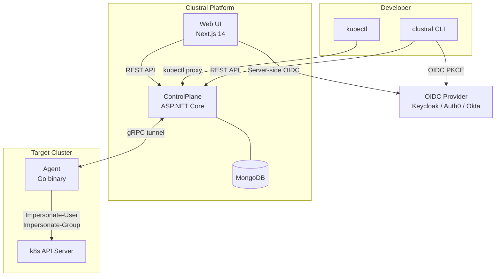
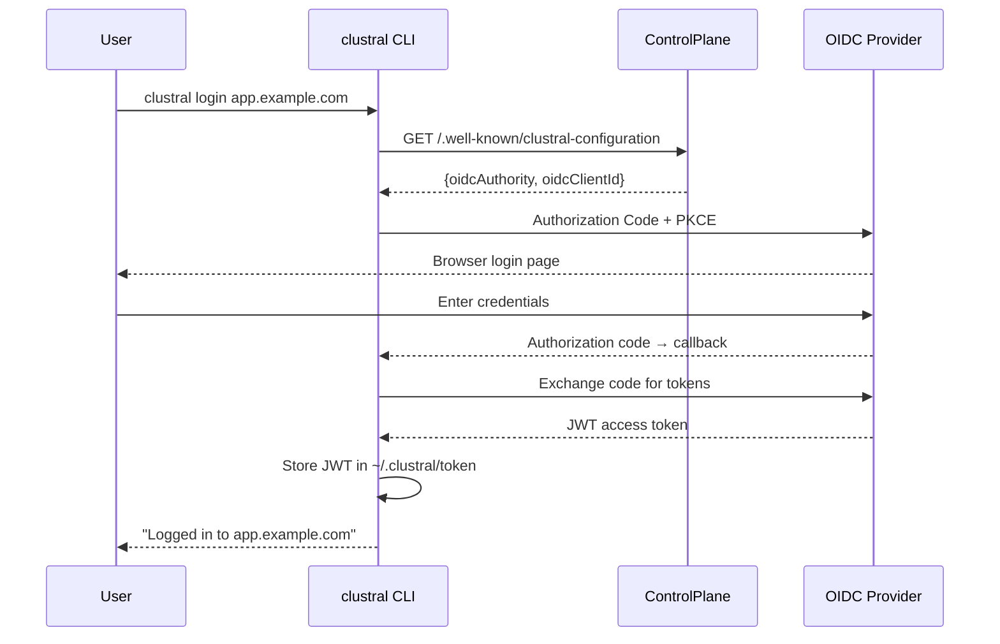
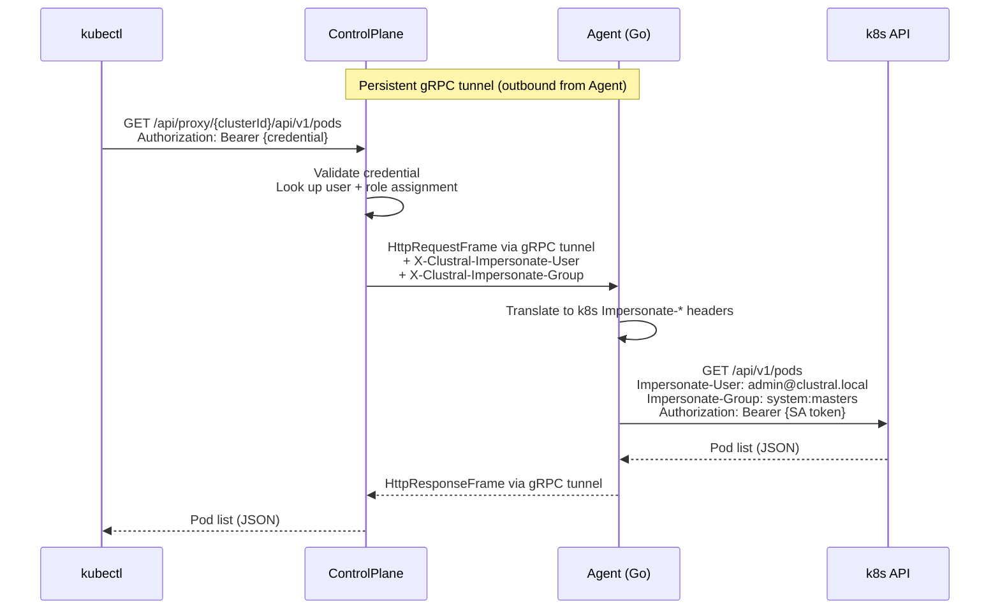
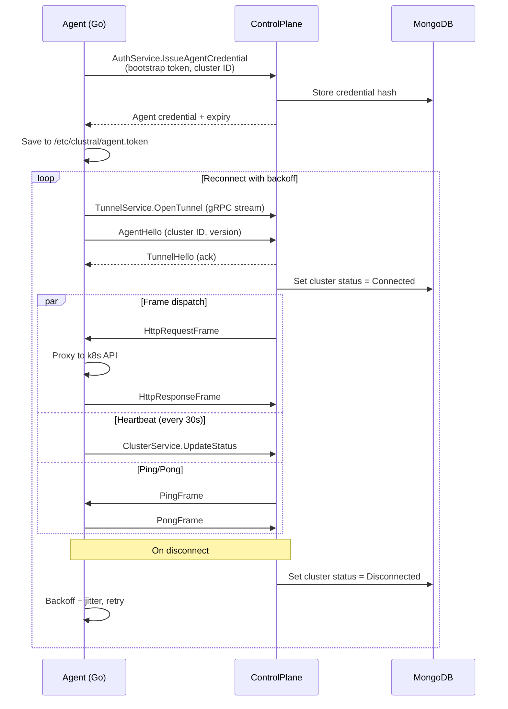
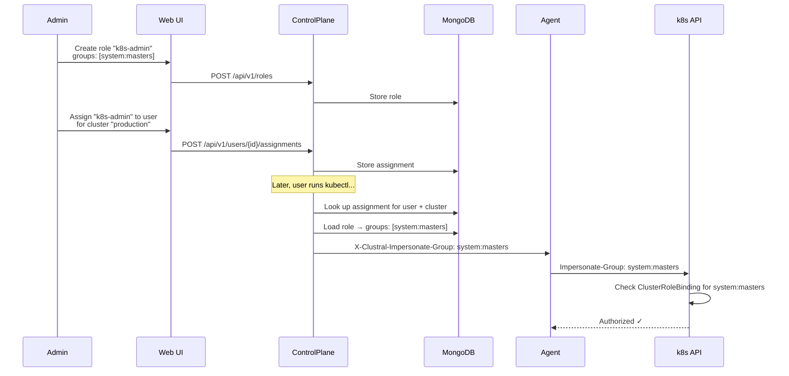

# Clustral

Kubernetes access proxy — a Teleport alternative built on .NET, Go and React.

Clustral lets users authenticate via any OIDC provider (Keycloak, Auth0, Okta, Azure AD), then transparently proxies `kubectl` traffic through a control plane to registered cluster agents. No inbound firewall rules required on the cluster side.

## Architecture



| Component        | Stack                                       | Description                                     |
|------------------|---------------------------------------------|-------------------------------------------------|
| **Web**          | Next.js 14, React 18, TypeScript, Tailwind  | Dashboard, server-side OIDC via NextAuth        |
| **ControlPlane** | ASP.NET Core, MongoDB                       | REST + gRPC server, kubectl tunnel proxy        |
| **Agent**        | Go 1.23, gRPC, 16MB static binary           | Deployed per cluster, tunnels kubectl traffic   |
| **CLI**          | .NET NativeAOT, System.CommandLine          | `clustral login` / `clustral kube login`        |

## How It Works

Clustral provides secure, tunneled `kubectl` access to Kubernetes clusters without requiring inbound firewall rules, VPNs, or bastion hosts.

### Authentication Flow



### kubectl Proxy Flow



### Agent Tunnel Lifecycle



### Role-Based Access Management



### Security Model

| Layer | Mechanism |
|---|---|
| User → ControlPlane | OIDC JWT (from any provider) |
| kubectl → ControlPlane | Short-lived bearer token (SHA-256 hashed, never stored raw) |
| Agent → ControlPlane | Long-lived agent credential (issued via bootstrap token, rotatable) |
| Agent → k8s API | In-cluster ServiceAccount token + k8s Impersonation API |
| Tunnel transport | gRPC over HTTP/2 (TLS in production) |
| Agent connectivity | Outbound only — no inbound firewall rules needed |
| Per-user k8s access | Role assignments with k8s group impersonation (system:masters, etc.) |

### Token Lifecycle

```
Bootstrap token (one-time, from registration)
  → exchanged for agent credential (1 year, rotatable)
    → agent uses it to open gRPC tunnel

OIDC JWT (short-lived, from Keycloak/Auth0/etc.)
  → exchanged for kubeconfig credential (8 hours default, configurable)
    → used by kubectl to authenticate proxy requests
    → revoked on logout
```

## Quick Start (On-Prem)

Deploy the full stack from pre-built images.

### 1. Create `docker-compose.yml`

```yaml
services:
  mongo:
    image: mongo:8
    restart: unless-stopped
    volumes:
      - mongo_data:/data/db
    healthcheck:
      test: ["CMD", "mongosh", "--eval", "db.adminCommand('ping')"]
      interval: 5s
      timeout: 5s
      retries: 10

  keycloak:
    image: quay.io/keycloak/keycloak:24.0
    restart: unless-stopped
    command: start-dev --import-realm
    environment:
      KEYCLOAK_ADMIN: admin
      KEYCLOAK_ADMIN_PASSWORD: admin
      KC_HTTP_PORT: 8080
      KC_HOSTNAME_STRICT: "false"
    ports:
      - "8080:8080"
    volumes:
      - ./keycloak:/opt/keycloak/data/import:ro
    healthcheck:
      test: ["CMD-SHELL", "exec 3<>/dev/tcp/localhost/8080 && echo -e 'GET /health/ready HTTP/1.1\\r\\nHost: localhost\\r\\nConnection: close\\r\\n\\r\\n' >&3 && head -1 <&3 | grep -q '200 OK'"]
      interval: 10s
      timeout: 10s
      retries: 30
      start_period: 60s

  controlplane:
    image: ghcr.io/clustral/clustral-controlplane:latest
    restart: unless-stopped
    depends_on:
      mongo:
        condition: service_healthy
      keycloak:
        condition: service_healthy
    environment:
      ASPNETCORE_ENVIRONMENT: Development
      ConnectionStrings__Clustral: "mongodb://mongo:27017"
      MongoDB__DatabaseName: "clustral"
      Keycloak__Authority: "http://<YOUR_HOST_IP>:8080/realms/clustral"
      Keycloak__MetadataAddress: "http://<YOUR_HOST_IP>:8080/realms/clustral/.well-known/openid-configuration"
      Keycloak__ClientId: "clustral-control-plane"
      Keycloak__Audience: "clustral-control-plane"
      Keycloak__RequireHttpsMetadata: "false"
    ports:
      - "5100:5000"
      - "5101:5001"
    healthcheck:
      test: ["CMD-SHELL", "curl -sf http://localhost:5000/healthz || exit 1"]
      interval: 10s
      timeout: 5s
      retries: 10
      start_period: 15s

  web:
    image: ghcr.io/clustral/clustral-web:latest
    restart: unless-stopped
    depends_on:
      controlplane:
        condition: service_healthy
    environment:
      NEXTAUTH_URL: "http://<YOUR_HOST_IP>:3000"
      CONTROLPLANE_URL: "http://<YOUR_HOST_IP>:5100"
      OIDC_ISSUER: "http://<YOUR_HOST_IP>:8080/realms/clustral"
      OIDC_CLIENT_ID: "clustral-web"
      OIDC_CLIENT_SECRET: "clustral-web-secret"
      AUTH_SECRET: "change-me-to-a-random-32-char-string!!"
    ports:
      - "3000:3000"

volumes:
  mongo_data:
```

> Replace `<YOUR_HOST_IP>` with your machine's IP address. All services must use the same IP so the browser, Next.js server, and ControlPlane can all reach Keycloak at the same issuer URL.

### 2. Download the Keycloak realm config

```bash
mkdir -p keycloak
curl -sL https://raw.githubusercontent.com/Clustral/clustral/main/infra/keycloak/clustral-realm.json \
  -o keycloak/clustral-realm.json
```

### 3. Start

```bash
docker compose up -d
```

### 4. Default users (Keycloak)

| Username | Password | Role             |
|----------|----------|------------------|
| `admin`  | `admin`  | `clustral-admin` |
| `dev`    | `dev`    | `clustral-user`  |

## CLI Usage

```bash
# Authenticate — discovers OIDC settings from the ControlPlane
clustral login app.clustral.example

# List available clusters
clustral kube ls

# Connect to a cluster (writes kubeconfig)
clustral kube login <cluster-id>

# kubectl works transparently
kubectl get pods -A

# List all registered clusters
clustral clusters list

# Sign out — revokes credentials, removes kubeconfig contexts
clustral logout
```

Build the CLI from source (single NativeAOT binary, no runtime dependencies):

```bash
dotnet publish src/Clustral.Cli -r osx-arm64 -c Release    # macOS Apple Silicon
dotnet publish src/Clustral.Cli -r linux-x64  -c Release    # Linux
dotnet publish src/Clustral.Cli -r win-x64    -c Release    # Windows
```

## Deploy an Agent

Register a cluster in the Web UI, then deploy the Go agent to your Kubernetes cluster:

```bash
# Apply RBAC
kubectl apply -f https://raw.githubusercontent.com/Clustral/clustral/main/src/clustral-agent/k8s/serviceaccount.yaml
kubectl apply -f https://raw.githubusercontent.com/Clustral/clustral/main/src/clustral-agent/k8s/clusterrole.yaml
kubectl apply -f https://raw.githubusercontent.com/Clustral/clustral/main/src/clustral-agent/k8s/clusterrolebinding.yaml

# Create the secret (values from the UI registration step)
kubectl -n clustral create secret generic clustral-agent-config \
  --from-literal=cluster-id="<CLUSTER_ID>" \
  --from-literal=control-plane-url="http://<CONTROLPLANE_HOST>:5001" \
  --from-literal=bootstrap-token="<BOOTSTRAP_TOKEN>"

# Deploy the agent
kubectl apply -f https://raw.githubusercontent.com/Clustral/clustral/main/src/clustral-agent/k8s/deployment.yaml

# Check status
kubectl -n clustral logs -f deploy/clustral-agent
```

The agent connects outbound to the ControlPlane gRPC port — no inbound firewall rules needed.

For Docker Desktop Kubernetes, use `host.docker.internal`:

```bash
--from-literal=control-plane-url="http://host.docker.internal:5001"
```

## Access Management

Clustral has a built-in role-based access management system. OIDC handles authentication, Clustral handles authorization.

### Concepts

- **Users** — synced automatically from the OIDC provider on first login
- **Roles** — define which Kubernetes groups to impersonate (e.g. `k8s-admin` → `system:masters`)
- **Assignments** — bind a user to a role for a specific cluster (per-cluster access control)

### Setup

1. Navigate to **Roles** in the Web UI and create roles:
   - `k8s-admin` with groups `system:masters` (full cluster access)
   - `k8s-viewer` with groups `clustral-viewer` (read-only)

2. Navigate to **Users**, select a user, and assign roles per cluster

3. On each target cluster, create the corresponding k8s RBAC bindings:

```bash
# Full access for the k8s-admin role
kubectl create clusterrolebinding clustral-admins \
  --clusterrole=cluster-admin --group=system:masters

# Read-only for the k8s-viewer role
kubectl create clusterrolebinding clustral-viewers \
  --clusterrole=view --group=clustral-viewer
```

### How it works

When a user runs `kubectl`, the ControlPlane looks up their role assignment for the target cluster, resolves the role's Kubernetes groups, and sends them as `Impersonate-Group` headers through the tunnel. The Go agent sets these as separate HTTP headers on the request to the k8s API server, which enforces RBAC per the impersonated identity.

Users without a role assignment for a cluster receive `403: No role assigned for this cluster`.

## Repository Layout

```
clustral/
├── src/
│   ├── Clustral.ControlPlane/   # ASP.NET Core — REST + gRPC + kubectl proxy
│   ├── clustral-agent/          # Go — gRPC tunnel + kubectl proxy (16MB binary)
│   ├── Clustral.Cli/            # .NET NativeAOT — login + kubeconfig management
│   └── Clustral.Web/            # Next.js 14 — dashboard, server-side OIDC
├── packages/
│   ├── Clustral.Sdk/            # Shared .NET: TokenCache, KubeconfigWriter
│   └── proto/                   # Protobuf contracts (shared between .NET + Go)
├── infra/
│   ├── keycloak/                # Realm export with pre-configured clients
│   └── docker-compose.yml       # Infrastructure (MongoDB, Keycloak, SSL proxy)
├── .github/workflows/           # CI/CD — build, test, multi-arch image push
├── docker-compose.yml           # Application stack (ControlPlane + Web)
└── CLAUDE.md                    # Claude Code guide
```

## Container Images

Published to GitHub Container Registry (manually triggerable or on source changes):

| Image | Stack | Size |
|---|---|---|
| `ghcr.io/clustral/clustral-controlplane` | .NET 10 | ~80MB |
| `ghcr.io/clustral/clustral-agent` | Go 1.23 | ~16MB |
| `ghcr.io/clustral/clustral-web` | Node.js 20 | ~50MB |

Tags: `latest`, `main`, commit SHA, semver (`v1.0.0`, `v1.0`) on tagged releases.

## Development

### Prerequisites

- Docker Desktop (or OrbStack)
- .NET 10 SDK
- Go 1.23+
- Node.js 20+ and bun
- kubectl

### Run from source

```bash
# Start infrastructure
docker compose -f infra/docker-compose.yml up -d

# Start application
docker compose up -d

# Or run natively:

# ControlPlane
dotnet run --project src/Clustral.ControlPlane

# Web UI
cd src/Clustral.Web && bun install && bun dev

# Agent (Go)
cd src/clustral-agent && go run . 
# Set env vars: AGENT_CLUSTER_ID, AGENT_CONTROL_PLANE_URL, AGENT_BOOTSTRAP_TOKEN
```

### Run tests

```bash
# .NET
dotnet test Clustral.slnx

# Go Agent
cd src/clustral-agent && go test ./...
```

## Web UI Environment Variables

| Variable | Required | Default | Description |
|---|---|---|---|
| `NEXTAUTH_URL` | Yes | — | Browser-facing URL of the Web UI |
| `CONTROLPLANE_URL` | Yes | `http://localhost:5000` | ControlPlane REST API URL |
| `OIDC_ISSUER` | Yes | — | OIDC provider discovery URL |
| `OIDC_CLIENT_ID` | No | `clustral-web` | OIDC client ID |
| `OIDC_CLIENT_SECRET` | Yes | — | OIDC client secret |
| `AUTH_SECRET` | Yes | — | NextAuth session encryption key |

## Agent Environment Variables

| Variable | Required | Default | Description |
|---|---|---|---|
| `AGENT_CLUSTER_ID` | Yes | — | Cluster ID from registration |
| `AGENT_CONTROL_PLANE_URL` | Yes | — | ControlPlane gRPC endpoint |
| `AGENT_BOOTSTRAP_TOKEN` | First boot | — | One-time bootstrap token |
| `AGENT_CREDENTIAL_PATH` | No | `~/.clustral/agent.token` | Token file path |
| `AGENT_KUBERNETES_API_URL` | No | `https://kubernetes.default.svc` | k8s API server URL |
| `AGENT_KUBERNETES_SKIP_TLS_VERIFY` | No | `false` | Skip k8s TLS (dev only) |
| `AGENT_HEARTBEAT_INTERVAL` | No | `30s` | Heartbeat frequency |

## Keycloak Configuration

The realm export at `infra/keycloak/clustral-realm.json` pre-configures:

| Client                   | Type          | Purpose                                         |
|--------------------------|---------------|--------------------------------------------------|
| `clustral-control-plane` | Bearer-only   | JWT validation by the ControlPlane               |
| `clustral-cli`           | Public        | CLI PKCE flow, redirect to `127.0.0.1:7777`     |
| `clustral-web`           | Confidential  | Web UI server-side OIDC via NextAuth             |

## License

Copyright (c) 2026 KubeIT. All rights reserved. See [LICENSE](LICENSE).
