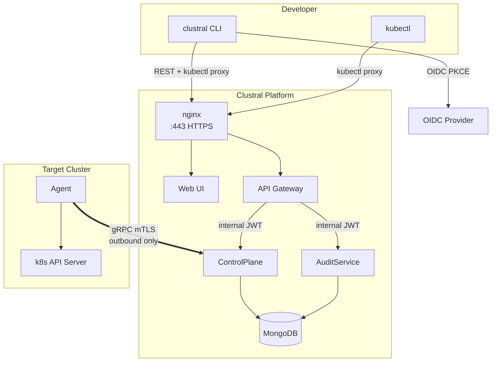

# Clustral

Clustral is a Kubernetes access proxy: your users `kubectl` through it, and Clustral handles the authentication, authorization, auditing, and tunneling. It's an open-source alternative to Teleport, built on .NET, Go, and React.

## Why Clustral

- **OIDC authentication against your identity provider** — Keycloak, Auth0, Okta, Azure AD, or any standards-compliant OIDC server. Clustral does not own user identities.
- **No inbound firewall rules on clusters** — agents open an outbound gRPC mTLS tunnel to the control plane. Reachability works the same in private networks, behind NATs, and in air-gapped sites with only egress to the control plane.
- **Just-in-time access grants** — users request a role on a cluster for a bounded time window. Admins approve, deny, or revoke. Access expires automatically when the grant window closes.
- **End-to-end audit trail** — every authentication, access-request state change, credential issuance, and proxy request is logged to a dedicated audit service and queryable via REST.
- **Self-service CLI** — `clustral login` for the OIDC flow, `clustral kube login` to mint a time-limited kubeconfig entry that routes through the proxy. No static tokens on developer laptops.

## How it works

The control plane is a small stack — an nginx edge, a YARP API Gateway, an ASP.NET Core ControlPlane, an ASP.NET Core AuditService, MongoDB, and RabbitMQ. The only thing that runs in your Kubernetes clusters is a single ~16MB Go binary deployed as a Deployment with a ClusterRole for user impersonation. For the full wire picture, read [Architecture Overview](architecture/README.md).

## Where to go next

| If you want to… | Read |
|---|---|
| Run Clustral locally for development | [Local Development](getting-started/local-development.md) |
| Deploy Clustral on a single VM for a small team | [On-Prem Docker Compose](getting-started/on-prem-docker-compose.md) |
| Understand the authentication and tunnel design | [Architecture Overview](architecture/README.md) |
| Review the security model before a deployment | [Security Model](security-model/README.md) |
| Look up a `clustral` command | [CLI Reference](cli-reference/README.md) |
| Look up a specific error code from a response or log | [Error Reference](errors/README.md) |
| Deploy the agent into a new cluster | [Agent Deployment](agent-deployment/README.md) |

## Community and support

- **Source, issues, and pull requests:** [github.com/Clustral/clustral](https://github.com/Clustral/clustral)
- **Security disclosures:** see [SECURITY.md](https://github.com/Clustral/clustral/blob/main/SECURITY.md) in the repository. Do not open public issues for suspected vulnerabilities.
- **Docs contributions:** [Contributing to the docs](CONTRIBUTING.md).

Clustral is open source under the license in the [LICENSE](https://github.com/Clustral/clustral/blob/main/LICENSE) file at the repository root.
