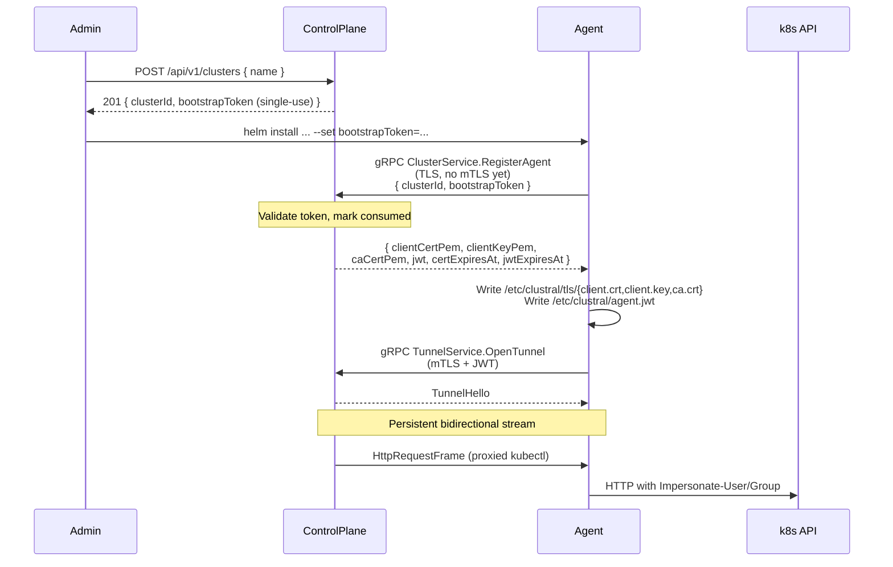

# mTLS Bootstrap

Agents authenticate to the control plane with an mTLS client certificate issued by the Clustral internal CA, plus an RS256 JWT for tunnel session authorization. Both are obtained at bootstrap via a single-use token.

## Overview

The bootstrap token is the only credential you hand to an agent by hand. Everything else — the client cert, the private key, the JWT — is materialized on the agent's filesystem during `RegisterAgent` and rotated in-band from then on. This page traces the full lifecycle: token issuance, first-contact registration, steady-state renewal, and recovery after failure.


The tunnel relies on **two** independent credentials: an mTLS certificate (proves the agent holds a CA-signed key tied to the cluster) and a JWT (carries the cluster identity and a token version the control plane can invalidate). They renew on different schedules. See [Security Model — mTLS & JWT Lifecycle](../security-model/mtls-jwt-lifecycle.md) for the cryptographic details.


## Bootstrap flow



## Bootstrap token

Issued by `POST /api/v1/clusters` (admin auth required). The token is returned in the response body exactly once — the control plane stores only its hash. Re-display is not possible.

| Property | Value |
|---|---|
| Scope | A single `clusterId`. |
| Uses | Exactly one. The first successful `ClusterService.RegisterAgent` call consumes it atomically. |
| TTL | No hard expiry; operationally treat it as a secret that should be used immediately. |
| Revocation | Deregister the cluster (`DELETE /api/v1/clusters/{id}`). This invalidates the token and any existing agent credentials. |
| Storage on the agent | Environment variable `AGENT_BOOTSTRAP_TOKEN` (typically from a Kubernetes `Secret`). Once consumed, the agent no longer needs it. |


You cannot re-use a bootstrap token to recover a dead agent. If an agent loses its mTLS credentials, deregister the cluster, issue a new token, and redeploy. There is no "re-bootstrap in place."


Replay protection: the second `RegisterAgent` call with the same token returns `TOKEN_ALREADY_USED`. This is enforced by an atomic update in the ControlPlane — consumption is race-free.

## Client certificate

Issued by the Clustral internal CA on successful `RegisterAgent`.

| Property | Default | Source |
|---|---|---|
| Validity | 395 days | `CertificateAuthority:ClientCertValidityDays` (`appsettings.json`) |
| Signature | SHA-256 with RSA | Clustral CA (`infra/ca/`) |
| Subject | `CN=<clusterId>` | Used server-side for routing |
| Storage | `/etc/clustral/tls/client.{crt,key}` and `ca.crt` | Written atomically by the agent |

The private key never leaves the agent pod. The chart uses an `emptyDir` volume by default, which means a pod restart preserves the credentials across container restarts but a rescheduled pod re-bootstraps. For long-lived agents, mount a `PersistentVolumeClaim` at `/etc/clustral` so the credentials survive rescheduling.

### Renewal

The agent's renewal manager checks expiry every `AGENT_RENEWAL_CHECK_INTERVAL` (default `6h`). If the cert's remaining validity drops below `AGENT_CERT_RENEW_THRESHOLD` (default `720h` / 30 days), it calls `ClusterService.RenewCertificate` over the live mTLS channel. The new cert replaces the old one atomically; the active tunnel stays open.

Renewal failures are logged but don't take the tunnel down — the existing cert keeps working until the real expiry. If the cert actually expires before a successful renewal, the next TLS handshake fails with `tls: certificate expired` and the agent loops in the `Reconnecting` state. Recovery: re-bootstrap.

## Tunnel JWT

RS256-signed, short-lived. The agent receives a fresh JWT on every `RegisterAgent` and `RenewToken` call, and sends it as gRPC per-RPC metadata on every call including the `OpenTunnel` stream open.

| Claim | Meaning |
|---|---|
| `iss` | Control-plane issuer URL |
| `aud` | `clustral-agent` |
| `sub` | `clusterId` |
| `tokenVersion` | Monotonic counter. Incremented on explicit revocation; the `AgentAuthInterceptor` rejects tokens below the current version. |
| `exp` | Expiry. Default TTL depends on your `Auth:AgentJwt` config. |

### Renewal

Same renewal manager, separate threshold: `AGENT_JWT_RENEW_THRESHOLD` (default `168h` / 7 days). `RenewToken` does **not** increment `tokenVersion`, so the old and new JWTs are both valid during the overlap window — an in-flight RPC that started with the old token finishes cleanly.

## Renewal lifecycle at a glance

| Credential | Renewal RPC | Renew when expiry within | Default TTL |
|---|---|---|---|
| mTLS client certificate | `ClusterService.RenewCertificate` | `AGENT_CERT_RENEW_THRESHOLD` (720h / 30d) | 395 days |
| Tunnel JWT | `ClusterService.RenewToken` | `AGENT_JWT_RENEW_THRESHOLD` (168h / 7d) | Config-dependent |

Both RPCs run over the existing mTLS + JWT channel, so no new auth handshake is required.

## Re-bootstrap (recovery)

Two scenarios, same procedure:

**Scenario A — cluster still registered, credentials lost** (pod rescheduled onto a node without the PVC, `emptyDir` wiped, accidental `kubectl delete secret`):

```bash
# On an admin machine
clustral clusters deregister my-cluster
clustral clusters register my-cluster
# → new bootstrap token

# In the target cluster
helm upgrade clustral-agent clustral/clustral-agent \
  --namespace clustral-system \
  --reuse-values \
  --set bootstrapToken=bst_ey... \
  --set clusterId=<new-cluster-id>
kubectl -n clustral-system rollout restart deploy/clustral-agent
```

**Scenario B — starting over** (cluster removed, needs re-adding): identical steps. There is no state from the previous registration that needs to be preserved — audit events survive because they key off event code and timestamp, not cluster GUID.


Re-registering creates a new `clusterId`. Static role assignments that referenced the old cluster ID must be recreated. Access requests tied to the old ID move to `Expired` when their window closes and remain in the audit log under the old ID.


## Air-gapped and custom PKI

If security policy requires agents to trust a CA other than the one Clustral ships with (enterprise PKI, offline root), mount the alternate CA via `caCertConfigMap` on the Helm chart *(planned — see [Helm Chart](helm-chart.md))*. The control plane's gRPC server certificate must chain to that CA as well, otherwise the agent's TLS handshake fails with `tls: unknown authority`.

Most deployments use the built-in CA (`infra/ca/`). It exists solely for agent authentication — it never issues certificates for users, nginx, or any public endpoint. See [Security Model](../security-model/README.md) for the trust-anchor inventory.

## Troubleshooting

| Symptom | What it means | Fix |
|---|---|---|
| `TOKEN_ALREADY_USED` on `RegisterAgent` | Bootstrap token already consumed. | Deregister the cluster, re-register to get a new token, redeploy the agent. |
| `INVALID_BOOTSTRAP_TOKEN` | Token mistyped or does not match any cluster. | Copy the token exactly from `clustral clusters register` output. |
| `tls: certificate expired` in agent logs | Cert expiry was missed by the renewal window. | Re-bootstrap. |
| `tls: unknown authority` | Control-plane server certificate does not chain to a CA the agent trusts. | Deploy a cert chained to the trusted CA, or mount the correct CA via `caCertConfigMap`. |
| `context deadline exceeded` on `RegisterAgent` | Control plane unreachable on `:5443`. | Verify DNS, firewall, and that the control plane is healthy. |
| `PermissionDenied` on `OpenTunnel` | JWT `tokenVersion` bumped (admin revoked) or cluster deregistered. | Re-bootstrap. Agent will not retry on its own. |
| `Unauthenticated` on any RPC | JWT expired between renewal checks. | Agent renews automatically and reconnects; no action required unless loops. |
| `RenewCertificate` / `RenewToken` fail repeatedly | Check the audit log for `CAG001W` entries. | Audit will show the exact reason — expired cert, revoked JWT, or cluster deregistered. |

## See also

- [Helm Chart](helm-chart.md) — install and values reference.
- [Architecture — Tunnel Lifecycle](../architecture/tunnel-lifecycle.md) — how the persistent stream runs and reconnects.
- [Security Model — mTLS & JWT Lifecycle](../security-model/mtls-jwt-lifecycle.md) — the trust model behind the credentials on this page.
- [Operator Guide — Troubleshooting](../operator-guide/troubleshooting.md) — diagnosing broken agents at the control-plane side.
