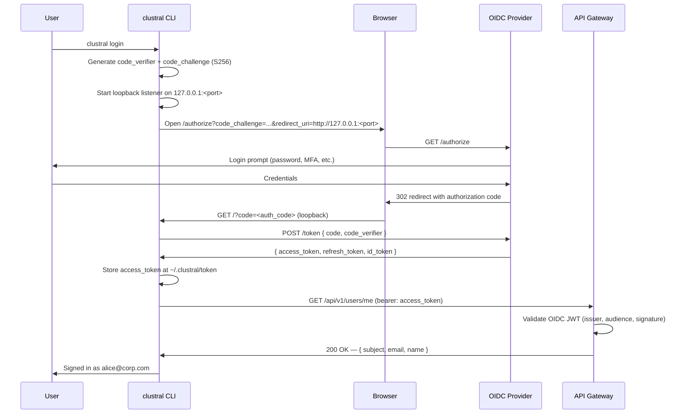
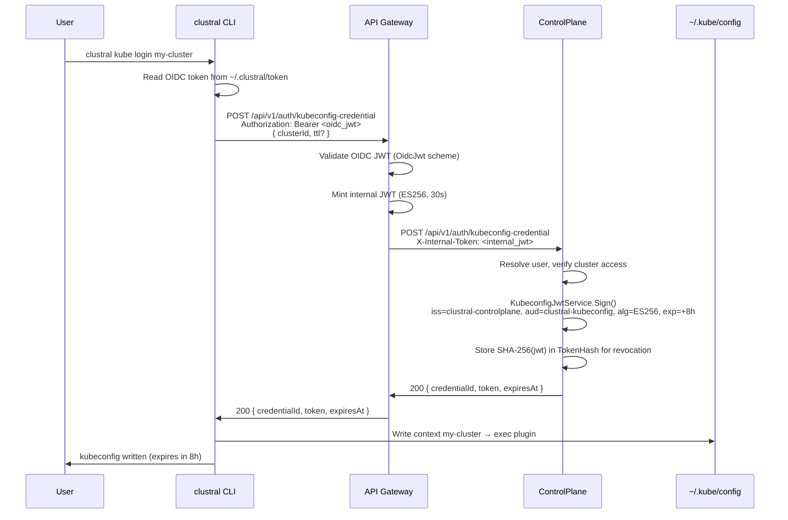
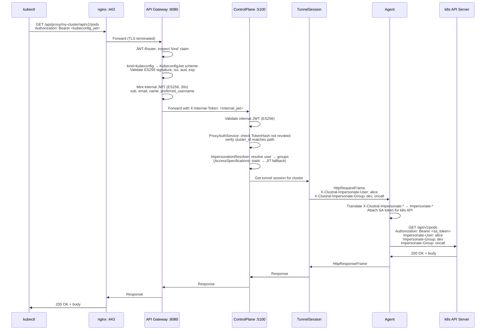

# Authentication Flows

Clustral uses three distinct JWTs to authenticate users, mint kubeconfig credentials, and authorize every kubectl proxy request. This page traces each flow end to end.

## Overview

There are three authentication moments in a Clustral session:

1. **`clustral login`** — OIDC PKCE flow against your identity provider. Issues a user-identity JWT that proves who the caller is.
2. **`clustral kube login`** — exchanges the OIDC JWT for an ES256 kubeconfig JWT scoped to one cluster. The CLI writes this into `~/.kube/config`.
3. **`kubectl` proxy request** — the gateway validates the kubeconfig JWT, mints a 30-second internal JWT, and forwards the request to the ControlPlane, which forwards it over the gRPC tunnel with k8s impersonation headers.

Each JWT has a different issuer, audience, algorithm, and lifetime. Keeping them separate is what lets a compromised OIDC signing key not forge a kubeconfig token, and a stolen kubeconfig token not call the ControlPlane REST API.


All three flows assume the gateway, ControlPlane, and your OIDC provider are reachable. Run `clustral doctor` if anything looks wrong — it probes each hop and reports the specific failure.


## Three JWTs at a glance

| JWT | Issuer | Audience | Algorithm | TTL | Where stored |
|---|---|---|---|---|---|
| OIDC | Your IdP | `clustral-control-plane` | Provider choice (typically RS256) | IdP-configured (30m–1h typical) | `~/.clustral/token` |
| Kubeconfig | `clustral-controlplane` | `clustral-kubeconfig` | ES256 | 8h default (max 8h) | `~/.kube/config` |
| Internal | `clustral-gateway` | `clustral-internal` | ES256 | 30s | Not persisted (per-request) |

The OIDC JWT is owned by your identity provider — Clustral never signs it and never sees the user's password. The kubeconfig JWT is signed by the ControlPlane with a private key under `infra/kubeconfig-jwt/private.pem` and validated by the gateway with the matching public key. The internal JWT is signed by the gateway with `infra/internal-jwt/private.pem` and validated by every downstream service (ControlPlane, AuditService).

## `clustral login` — OIDC PKCE flow

`clustral login` runs the standards-compliant OAuth 2.1 authorization code flow with PKCE ([RFC 7636](https://www.rfc-editor.org/rfc/rfc7636)). PKCE removes the need for a client secret, so the CLI ships without embedded credentials.



Key points:

- The **authorization code** never leaves the loopback listener. The CLI exchanges it for a token directly with the IdP, so the gateway never sees the code.
- The token's `aud` claim must match `OIDC_AUDIENCE` on the gateway, or the gateway rejects every subsequent request with `INVALID_TOKEN`.
- Tokens live at `~/.clustral/token` with `0600` permissions. Delete the file to force re-auth, or run `clustral logout` to delete it and revoke any active kubeconfig credentials.
- The CLI does not use `id_token` — only `access_token`. The `id_token` is discarded.

## `clustral kube login` — kubeconfig JWT exchange

`clustral kube login <cluster>` exchanges the user's OIDC JWT for an ES256 kubeconfig JWT scoped to one cluster, and writes a kubeconfig context that embeds the credential as an exec plugin.



The kubeconfig entry looks like this:

```yaml
contexts:
- name: my-cluster
  context:
    cluster: my-cluster
    user: my-cluster-user
users:
- name: my-cluster-user
  user:
    token: eyJhbGciOiJFUzI1NiIsInR5cCI6IkpXVCJ9...
clusters:
- name: my-cluster
  cluster:
    server: https://clustral.example.com/api/proxy/my-cluster
```

Claims on the kubeconfig JWT:

| Claim | Value |
|---|---|
| `iss` | `clustral-controlplane` |
| `aud` | `clustral-kubeconfig` |
| `sub` | User ID (internal) |
| `cluster_id` | Target cluster ID — binds the credential to one cluster |
| `jti` | Credential ID — used for revocation |
| `exp` | Issue time + `Credential:DefaultKubeconfigCredentialTtl` (8h default, capped at `MaxKubeconfigCredentialTtl`) |
| `kind` | `kubeconfig` — selects the gateway's `KubeconfigJwt` auth scheme |

The default TTL is configurable via `Credential:DefaultKubeconfigCredentialTtl` and capped by `Credential:MaxKubeconfigCredentialTtl`. The CLI can request a shorter TTL with `--ttl`, but not a longer one.


The kubeconfig JWT is a bearer token. Anyone with the token file can run `kubectl` as the bound user until the token expires or is revoked. Revoke with `clustral kube logout <cluster>` or via the ControlPlane's `DELETE /api/v1/auth/credentials/{id}`.


## `kubectl` — proxy auth chain

Once the kubeconfig is written, `kubectl` sends every request with the kubeconfig JWT in the `Authorization` header. The full auth chain involves five hops.



What each hop verifies:

| Hop | Checks |
|---|---|
| nginx `:443` | TLS handshake. Does not inspect the JWT. |
| Gateway — `JWT-Router` policy | Reads unverified `kind` claim to pick auth scheme. Tokens without `kind` default to `OidcJwt`. |
| Gateway — `KubeconfigJwt` scheme | ES256 signature against `KubeconfigJwt:PublicKeyPath`, issuer `clustral-controlplane`, audience `clustral-kubeconfig`, expiry, `nbf`. |
| Gateway — internal JWT issuer | Mints ES256 token signed with `InternalJwt:PrivateKeyPath`. Adds `X-Internal-Token`. |
| ControlPlane — `InternalJwtService` | ES256 signature against `InternalJwt:PublicKeyPath`, issuer `clustral-gateway`, audience `clustral-internal`, expiry. |
| ControlPlane — `ProxyAuthService` | `SHA-256(jwt)` not in revoked set; `cluster_id` claim matches the path. |
| ControlPlane — `ImpersonationResolver` | Resolves user → groups via `AccessSpecifications`. Static role assignment wins; falls back to the active JIT grant for that cluster. |
| Agent — `proxy.Handle` | Translates `X-Clustral-Impersonate-*` → k8s `Impersonate-*`, re-signs with the pod's ServiceAccount token. |
| k8s API server | RBAC against the impersonated user and groups. The agent's SA only needs the `impersonate` verb. |

The impersonation design is important: the agent's ServiceAccount has no direct read/write permissions on cluster resources. It only has the `impersonate` verb. Every resource-level decision is made by the k8s API server against the impersonated identity, so RBAC policies written for real users apply unchanged.

### Why two JWTs on the wire?

The gateway doesn't forward the kubeconfig JWT to the ControlPlane. Instead, it strips it and issues a fresh 30-second internal JWT. Two reasons:

- **Blast radius.** If an attacker recovers an internal JWT from a compromised ControlPlane, they have 30 seconds to use it — and only against downstream services. They cannot use it to call `kubectl`.
- **Simplicity downstream.** Downstream services only validate a single ES256 signature. They don't need OIDC JWKS, client secrets, or issuer metadata.

The gateway enforces this split with two strict schemes (`OidcJwt` and `KubeconfigJwt`), each with its own trust anchor. A compromised OIDC signing key cannot forge a kubeconfig token and vice versa.

## JIT access

For clusters where a user has no static role assignment, `kubectl` fails until the user has an active JIT grant. The flow is:

1. User runs `clustral access request --role developer --cluster my-cluster --for 4h`.
2. The request appears in the Web UI and `clustral access list` for admins.
3. An admin approves: `clustral access approve <id>`.
4. `ImpersonationResolver` picks up the active grant the next time `kubectl` calls, and `kubectl` starts working.
5. When the grant window closes, `AccessRequestCleanupService` expires the grant. The next `kubectl` call returns `FORBIDDEN`.

The user does not need to re-run `kube login` — the kubeconfig JWT is still valid; only the impersonation resolution changes.

## See also

- [Tunnel Lifecycle](tunnel-lifecycle.md) — how the agent opens the gRPC tunnel that the proxy chain ends on.
- [Network Map](network-map.md) — ports, directions, and firewall requirements for each hop.
- [Security Model](../security-model/README.md) — JWT key storage, rotation, and mTLS trust anchors.
- [`clustral login`](../cli-reference/login.md) — CLI reference for the OIDC flow.
