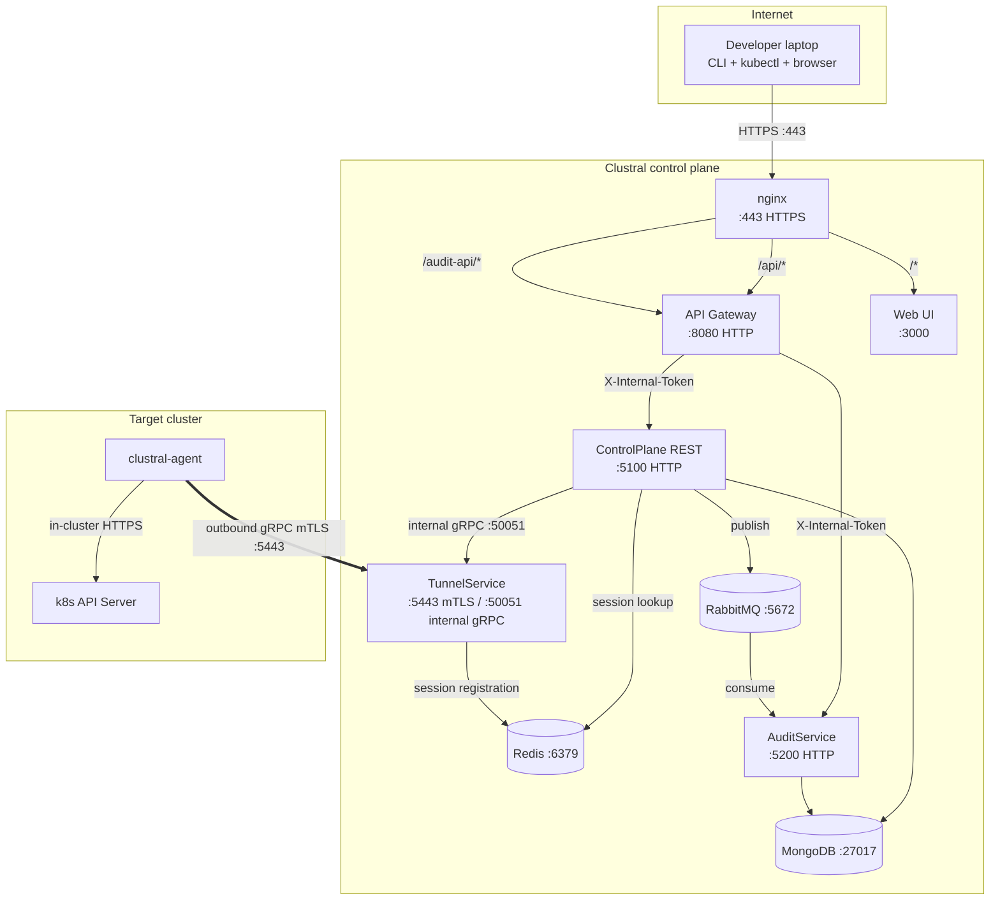
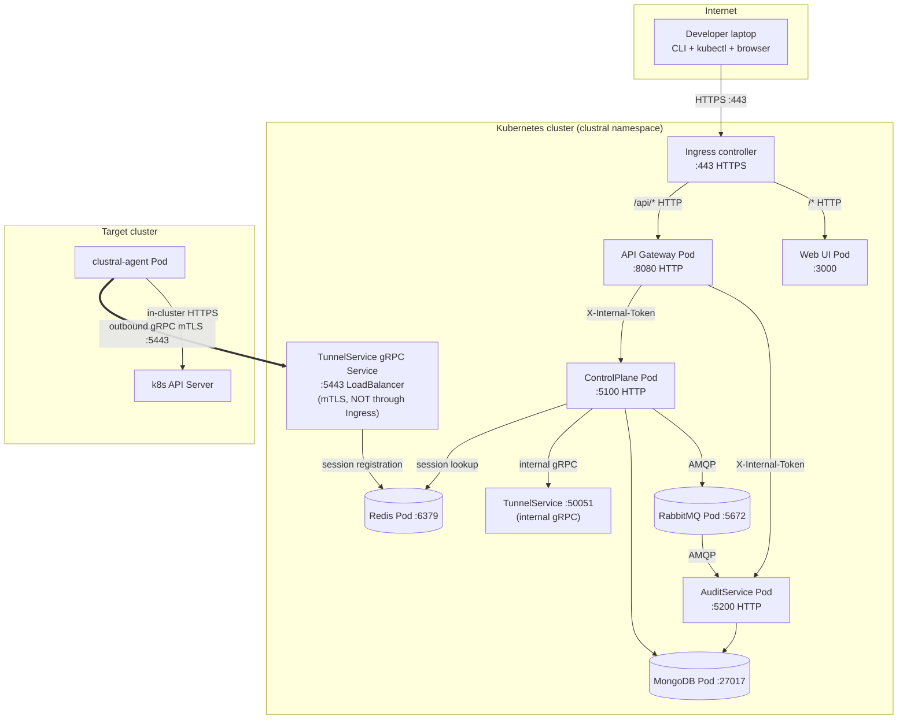
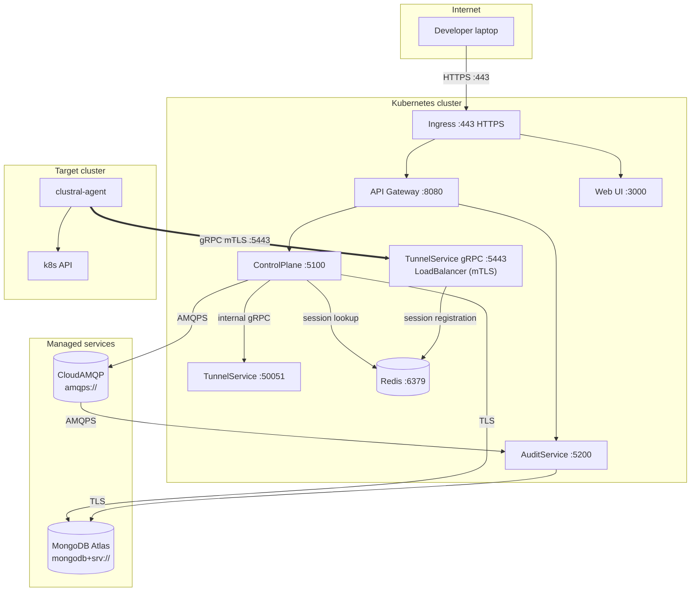
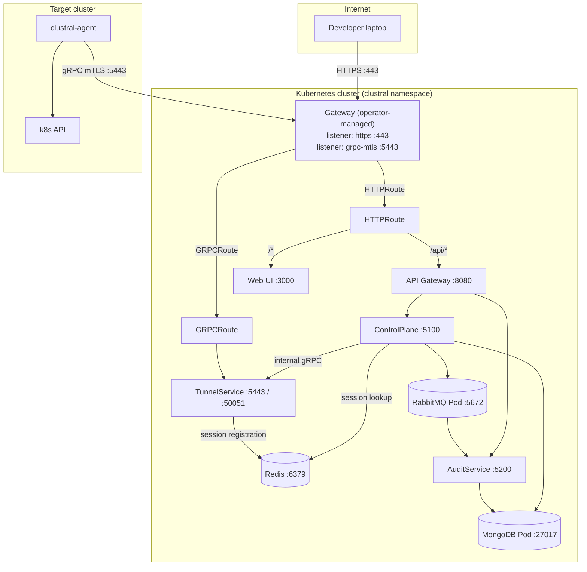

# Network Map

A single-page reference for the ports, directions, and auth boundaries in a Clustral deployment. Use it to write firewall rules and answer security-review questions.

## Overview

Clustral has one public entrypoint (nginx on `:443`), one dedicated agent ingress on the TunnelService (`:5443` for gRPC mTLS), and a handful of internal services that are never exposed. Users and kubectl traffic come in through `:443`; agents connect outbound to `:5443`. Nothing else needs to be reachable from the internet.


Clustral requires zero inbound firewall rules on your Kubernetes clusters. Agents open an outbound gRPC mTLS connection to the control plane. This is the property that lets Clustral work inside private VPCs, behind NATs, and in air-gapped sites.


## Port matrix

| Port  | Service       | Direction | Protocol     | Auth                              | Exposed to                                           |
|-------|---------------|-----------|--------------|-----------------------------------|------------------------------------------------------|
| 443   | nginx         | Inbound   | HTTPS        | (terminates TLS)                  | Users (CLI, Web UI, kubectl)                         |
| 5443  | TunnelService | Inbound   | gRPC/HTTP2   | mTLS + RS256 JWT                  | Agents only — restrict source CIDR if possible       |
| 50051 | TunnelService | Internal  | gRPC         | None (internal only)              | ControlPlane only                                    |
| 9090  | TunnelService | Internal  | HTTP         | None                              | Health checks                                        |
| 8080  | API Gateway   | Internal  | HTTP         | (reverse-proxied by nginx)        | nginx only (never expose externally)                 |
| 5100  | ControlPlane  | Internal  | HTTP         | Internal JWT (`X-Internal-Token`) | Gateway only                                         |
| 5200  | AuditService  | Internal  | HTTP         | Internal JWT (`X-Internal-Token`) | Gateway only                                         |
| 6379  | Redis         | Internal  | Redis wire   | None                              | TunnelService, ControlPlane                          |
| 27017 | MongoDB       | Internal  | MongoDB wire | Deployment-dependent              | ControlPlane, AuditService                           |
| 5672  | RabbitMQ      | Internal  | AMQP         | User/password                     | ControlPlane (publish), AuditService (consume)       |

"Internal" means the port is not reachable from outside the Docker network (single-VM deploys) or the Kubernetes namespace (chart-based deploys). Do not bind these ports to the host network.

## Wire diagram



The double arrow on `AGENT → TUNNEL` is the only link that crosses a network boundary into the target cluster — and it's agent-initiated. No traffic ever enters the cluster from the control plane side.

## Kubernetes deployment topology

When you deploy Clustral on Kubernetes (via the Helm chart), nginx is replaced by an Ingress or Gateway API resource. Internal communication stays HTTP. TLS terminates at the Ingress controller or Gateway, and the TunnelService's gRPC mTLS always runs on its own dedicated Service (never through the Ingress).

### Ingress + in-cluster dependencies

The default Helm install: Bitnami MongoDB + RabbitMQ run as subchart Pods in the same namespace. The Ingress controller handles TLS termination.



Key differences from Docker Compose:
- The Ingress controller replaces nginx. It terminates TLS using the `clustral-tls` Secret (created by cert-manager or manually).
- The TunnelService gRPC port (`:5443`) is exposed via a **separate LoadBalancer Service**, bypassing the Ingress entirely. Agents connect directly to it. This preserves the persistent bidirectional stream that breaks on L7 proxies.
- Redis runs as a Pod for the tunnel session registry. ControlPlane queries Redis to find which TunnelService pod holds a session, then calls TunnelProxy on that pod via internal gRPC (:50051).
- MongoDB and RabbitMQ run as Bitnami subchart Pods in the same namespace. Communication is in-cluster ClusterIP — no TLS needed.

### Ingress + external dependencies

For production: point at managed MongoDB (Atlas, DocumentDB) and RabbitMQ (CloudAMQP, Amazon MQ) outside the cluster. Set `mongodb.enabled: false` + `externalMongodb.connectionString` and `rabbitmq.enabled: false` + `externalRabbitmq.*` in Helm values.



The difference is the egress path: ControlPlane and AuditService need egress to the managed service endpoints (typically over TLS/AMQPS). Redis remains in-cluster for the TunnelService session registry. The `NetworkPolicy` templates allow this — configure `externalMongodb` and `externalRabbitmq` CIDRs if you run default-deny policies.

### Gateway API + in-cluster dependencies

Set `ingress.enabled: false` and `gatewayApi.enabled: true` in Helm values. You must deploy a Gateway resource separately (Envoy Gateway, Istio, Cilium, etc.).




With Gateway API, the gRPC agent traffic can optionally route through the Gateway (via `GRPCRoute` attached to a `grpc-mtls` listener) to TunnelService. This works with Gateway implementations that handle gRPC natively (Envoy Gateway, Istio). Alternatively, disable `gatewayApi.grpcRoute.enabled` and use the standalone LoadBalancer Service — same as the Ingress topology.


The Gateway must have two listeners:

| Listener name | Port | Protocol | TLS mode | Purpose |
|---|---|---|---|---|
| `https` | 443 | HTTPS | Terminate | User traffic (CLI, Web UI, kubectl) |
| `grpc-mtls` | 5443 | TLS | Passthrough | Agent mTLS tunnel (the Gateway passes TLS through to the TunnelService, which does its own mTLS handshake) |

These listener names are configurable via `gatewayApi.httpListenerName` and `gatewayApi.grpcListenerName` in Helm values.

### Gateway API + external dependencies

Same as the Ingress + external diagram, but replace the Ingress with a Gateway and HTTPRoute/GRPCRoute. The external dependency traffic (MongoDB Atlas, CloudAMQP) is identical — it exits the cluster over TLS/AMQPS regardless of how the user-facing traffic enters.

### Internal communication — always HTTP

Regardless of topology, services talk HTTP inside the cluster:

| From | To | URL | Protocol |
|---|---|---|---|
| Ingress/Gateway | API Gateway | `http://clustral-api-gateway:8080` | HTTP |
| Ingress/Gateway | Web UI | `http://clustral-web:3000` | HTTP |
| API Gateway | ControlPlane | `http://clustral-controlplane:5100` | HTTP |
| API Gateway | AuditService | `http://clustral-audit-service:5200` | HTTP |
| Web UI | API Gateway | `http://clustral-api-gateway:8080` | HTTP |
| ControlPlane | Redis | `redis://clustral-redis:6379` | Redis wire |
| ControlPlane | TunnelService | `grpc://clustral-tunnel:50051` | gRPC |
| ControlPlane | MongoDB | `mongodb://clustral-mongodb:27017` | MongoDB wire |
| ControlPlane | RabbitMQ | `amqp://clustral-rabbitmq:5672` | AMQP |
| TunnelService | Redis | `redis://clustral-redis:6379` | Redis wire |
| AuditService | MongoDB | `mongodb://clustral-mongodb:27017` | MongoDB wire |
| AuditService | RabbitMQ | `amqp://clustral-rabbitmq:5672` | AMQP |

TLS terminates at the boundary (Ingress/Gateway for users, the TunnelService for agent mTLS). Everything behind that is plaintext inside the cluster network. If your security model requires encryption in transit for internal traffic, enable a service mesh (Istio/Linkerd mTLS) — the Clustral chart is mesh-compatible out of the box.

## Outbound from agents

An agent needs exactly one outbound connection:

| Destination | Port | Protocol | Purpose |
|---|---|---|---|
| TunnelService FQDN | `5443` | gRPC over TLS | Tunnel, registration, credential renewal |

No other egress is required. No DNS lookups for anything else. No third-party telemetry. No update checks. Security teams who need to allow-list egress traffic have exactly one hostname and one port to approve.

## Cluster-side requirements

Inside the cluster, the agent needs:

- **Network access to the Kubernetes API server.** The default `https://kubernetes.default.svc` resolves via the in-cluster DNS and works on every standards-compliant distribution. No other cluster-network permissions are required.
- **Read access to `/var/run/secrets/kubernetes.io/serviceaccount/`.** The agent reads the projected ServiceAccount token and CA bundle from this path. The mount is added by kubelet automatically for every pod.
- **RBAC: `impersonate` on `users`, `groups`, `serviceaccounts`.** Delivered by the Helm chart as a `ClusterRoleBinding`. Nothing else.

The agent does not need `get`, `list`, or `watch` on any resource. Every read and write is impersonated to the calling user, so authorization is enforced by the cluster's RBAC against real identities.

## Air-gapped and egress-limited deployments

If your clusters only allow egress to explicitly allow-listed hostnames, open exactly one rule:

- **Allow TCP `5443`** to the control plane's public FQDN (for example `clustral.example.com`).

No other egress is required. No container registry pulls at runtime (the agent image is pre-baked). No OIDC callbacks from the cluster (OIDC runs on the laptop, not in the cluster). No package repository access.

For the control plane side, you'll need:

- Egress from the control plane host to your OIDC provider's issuer URL (for JWKS and metadata). Usually HTTPS `:443`.
- Egress to your container registry and package mirrors for patching — same as any server.

## Why is the TunnelService a separate process?

The ControlPlane (`:5100`, REST only) and TunnelService (`:5443` gRPC mTLS, `:50051` internal gRPC) are separate processes. The ControlPlane is stateless — it queries Redis to find which TunnelService pod holds the agent session, then calls `TunnelProxy.ProxyRequest` on that pod's internal gRPC port.

Splitting tunnel management into a dedicated Go service is deliberate:

- **Stateless ControlPlane.** Multiple ControlPlane replicas can run behind a load balancer. No in-memory session state.
- **nginx cannot transparently proxy gRPC** without breaking long-lived bidirectional streams. The tunnel would drop on every nginx reload.
- **mTLS needs a distinct listener.** nginx handles TLS for `:443` with a public CA certificate. Agents authenticate with a private CA — the Clustral CA — that issues per-agent client certificates. Those are separate trust anchors with different rotation windows.
- **Redis-backed session registry** enables horizontal scaling of TunnelService pods. Each pod registers its sessions in Redis; the ControlPlane routes to the correct pod.

## Firewall rules — quick reference

**Control plane host:**

```
ALLOW IN  tcp/443  from 0.0.0.0/0        → nginx          (users, kubectl, Web UI)
ALLOW IN  tcp/5443 from <agent-CIDRs>    → TunnelService  (agents — restrict if possible)
ALLOW OUT tcp/443  to <oidc-issuer>      → Keycloak/Auth0/etc. (JWKS refresh)
ALLOW OUT tcp/443  to <registry>         → Docker Hub / ECR (patching only)
```

**Cluster running the agent:**

```
ALLOW OUT tcp/5443 to <controlplane-fqdn> → Clustral tunnel
# No inbound rules required.
```

If you run the control plane on Kubernetes, translate these into `NetworkPolicy` resources; the same principle applies.

## See also

- [Authentication Flows](authentication-flows.md) — what authenticates on each port.
- [Tunnel Lifecycle](tunnel-lifecycle.md) — how the `:5443` connection is opened and maintained.
- [Agent Deployment](../agent-deployment/README.md) — install the agent with the right egress rules.
- [Kubernetes Deployment](../operator-guide/kubernetes-deployment.md) — deploy the platform with Helm (Ingress or Gateway API).
- [On-Prem Docker Compose](../getting-started/on-prem-docker-compose.md) — the reference single-VM topology that matches the Docker Compose diagram.
