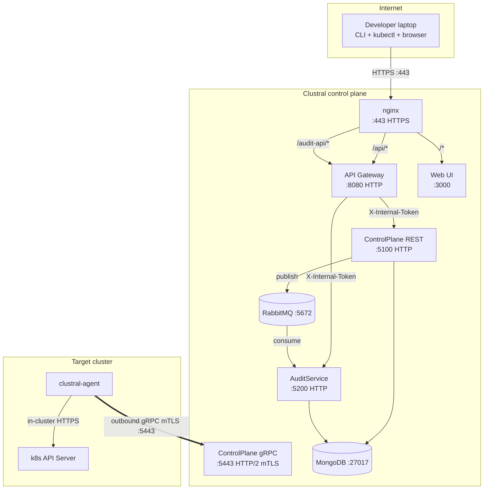

# Network Map

A single-page reference for the ports, directions, and auth boundaries in a Clustral deployment. Use it to write firewall rules and answer security-review questions.

## Overview

Clustral has one public entrypoint (nginx on `:443`), one dedicated agent ingress on the control plane (`:5443` for gRPC mTLS), and a handful of internal services that are never exposed. Users and kubectl traffic come in through `:443`; agents connect outbound to `:5443`. Nothing else needs to be reachable from the internet.


Clustral requires zero inbound firewall rules on your Kubernetes clusters. Agents open an outbound gRPC mTLS connection to the control plane. This is the property that lets Clustral work inside private VPCs, behind NATs, and in air-gapped sites.


## Port matrix

| Port  | Service       | Direction | Protocol     | Auth                              | Exposed to                                           |
|-------|---------------|-----------|--------------|-----------------------------------|------------------------------------------------------|
| 443   | nginx         | Inbound   | HTTPS        | (terminates TLS)                  | Users (CLI, Web UI, kubectl)                         |
| 5443  | ControlPlane  | Inbound   | gRPC/HTTP2   | mTLS + RS256 JWT                  | Agents only — restrict source CIDR if possible       |
| 8080  | API Gateway   | Internal  | HTTP         | (reverse-proxied by nginx)        | nginx only (never expose externally)                 |
| 5100  | ControlPlane  | Internal  | HTTP         | Internal JWT (`X-Internal-Token`) | Gateway only                                         |
| 5200  | AuditService  | Internal  | HTTP         | Internal JWT (`X-Internal-Token`) | Gateway only                                         |
| 27017 | MongoDB       | Internal  | MongoDB wire | Deployment-dependent              | ControlPlane, AuditService                           |
| 5672  | RabbitMQ      | Internal  | AMQP         | User/password                     | ControlPlane (publish), AuditService (consume)       |

"Internal" means the port is not reachable from outside the Docker network (single-VM deploys) or the Kubernetes namespace (chart-based deploys). Do not bind these ports to the host network.

## Wire diagram



The double arrow on `AGENT → CP_GRPC` is the only link that crosses a network boundary into the target cluster — and it's agent-initiated. No traffic ever enters the cluster from the control plane side.

## Outbound from agents

An agent needs exactly one outbound connection:

| Destination | Port | Protocol | Purpose |
|---|---|---|---|
| Control plane FQDN | `5443` | gRPC over TLS | Tunnel, registration, credential renewal |

No other egress is required. No DNS lookups for anything else. No third-party telemetry. No update checks. Security teams who need to allow-list egress traffic have exactly one hostname and one port to approve.

## Cluster-side requirements

Inside the cluster, the agent needs:

- **Network access to the Kubernetes API server.** The default `https://kubernetes.default.svc` resolves via the in-cluster DNS and works on every standards-compliant distribution. No other cluster-network permissions are required.
- **Read access to `/var/run/secrets/kubernetes.io/serviceaccount/`.** The agent reads the projected ServiceAccount token and CA bundle from this path. The mount is added by kubelet automatically for every pod.
- **RBAC: `impersonate` on `users`, `groups`, `serviceaccounts`.** Delivered by the Helm chart as a `ClusterRoleBinding`. Nothing else.

The agent does not need `get`, `list`, or `watch` on any resource. Every read and write is impersonated to the calling user, so authorization is enforced by the cluster's RBAC against real identities.

## Air-gapped and egress-limited deployments

If your clusters only allow egress to explicitly allow-listed hostnames, open exactly one rule:

- **Allow TCP `5443`** to the control plane's public FQDN (for example `clustral.example.com`).

No other egress is required. No container registry pulls at runtime (the agent image is pre-baked). No OIDC callbacks from the cluster (OIDC runs on the laptop, not in the cluster). No package repository access.

For the control plane side, you'll need:

- Egress from the control plane host to your OIDC provider's issuer URL (for JWKS and metadata). Usually HTTPS `:443`.
- Egress to your container registry and package mirrors for patching — same as any server.

## Why two ports on the control plane?

The control plane listens on two ports in the same process: `:5100` for REST (HTTP/1.1) and `:5443` for gRPC (HTTP/2 with mTLS). nginx terminates TLS for `:443` and forwards REST traffic to `:5100` via the API Gateway. Agent traffic bypasses nginx entirely and connects directly to Kestrel on `:5443`.

Splitting the ports is deliberate:

- **nginx cannot transparently proxy gRPC** without breaking long-lived bidirectional streams. The tunnel would drop on every nginx reload.
- **mTLS needs a distinct listener.** nginx handles TLS for `:443` with a public CA certificate. Agents authenticate with a private CA — the Clustral CA — that issues per-agent client certificates. Those are separate trust anchors with different rotation windows.
- **HTTP/1.1 and HTTP/2 content-type handling differ** in ways that make unified proxying brittle. Keeping them apart keeps each listener simple.

See `src/Clustral.ControlPlane/CLAUDE.md` for the full rationale and the code that sets up the two Kestrel endpoints.

## Firewall rules — quick reference

**Control plane host:**

```
ALLOW IN  tcp/443  from 0.0.0.0/0        → nginx          (users, kubectl, Web UI)
ALLOW IN  tcp/5443 from <agent-CIDRs>    → ControlPlane   (agents — restrict if possible)
ALLOW OUT tcp/443  to <oidc-issuer>      → Keycloak/Auth0/etc. (JWKS refresh)
ALLOW OUT tcp/443  to <registry>         → Docker Hub / ECR (patching only)
```

**Cluster running the agent:**

```
ALLOW OUT tcp/5443 to <controlplane-fqdn> → Clustral tunnel
# No inbound rules required.
```

If you run the control plane on Kubernetes, translate these into `NetworkPolicy` resources; the same principle applies.

## See also

- [Authentication Flows](authentication-flows.md) — what authenticates on each port.
- [Tunnel Lifecycle](tunnel-lifecycle.md) — how the `:5443` connection is opened and maintained.
- [Agent Deployment](../agent-deployment/README.md) — install the agent with the right egress rules.
- [On-Prem Docker Compose](../getting-started/on-prem-docker-compose.md) — the reference single-VM topology that matches this map.
