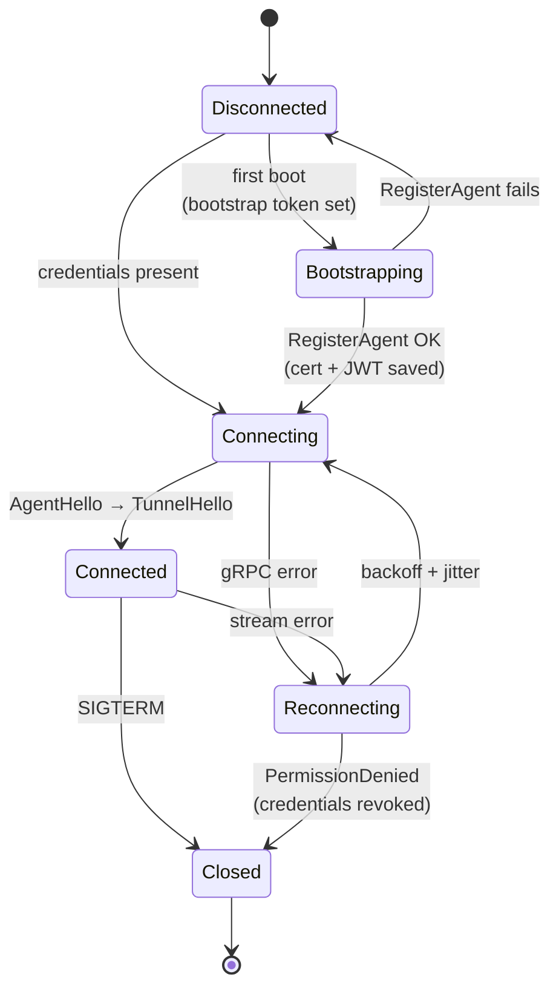
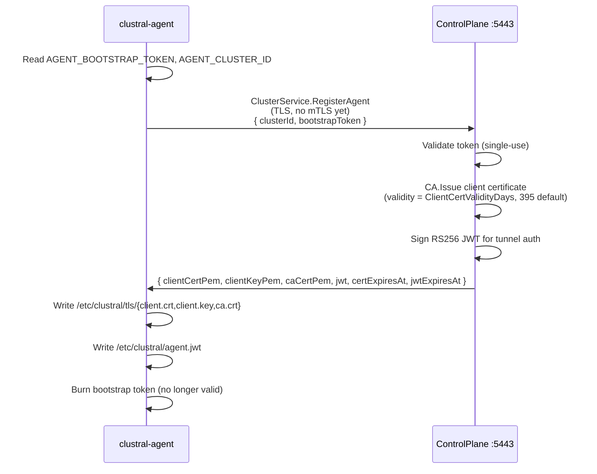
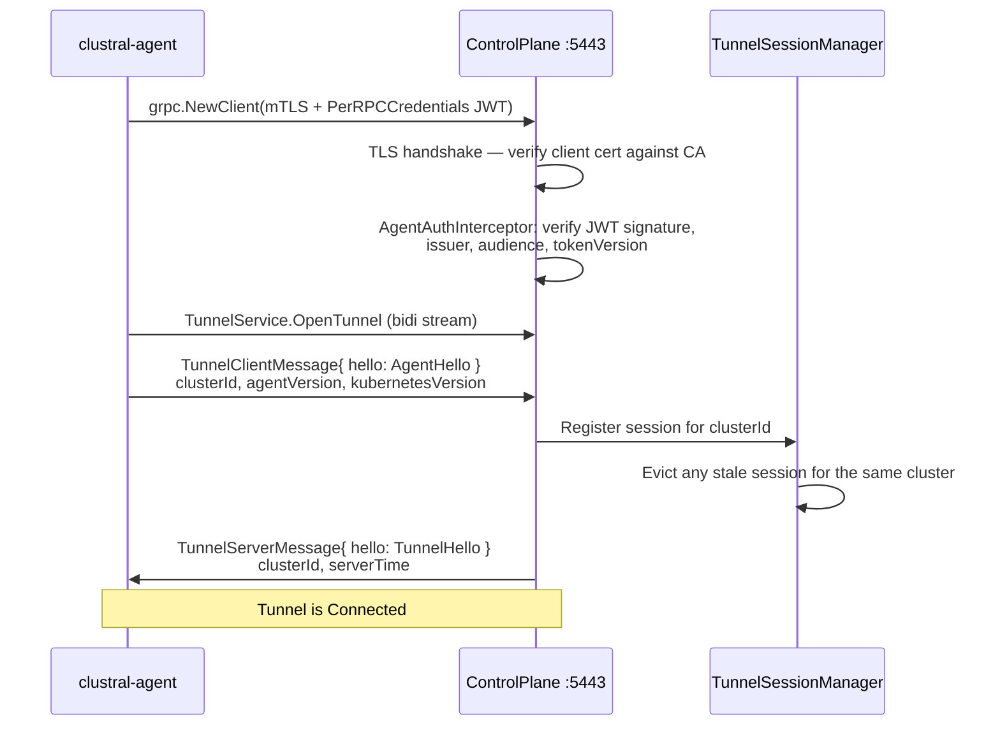
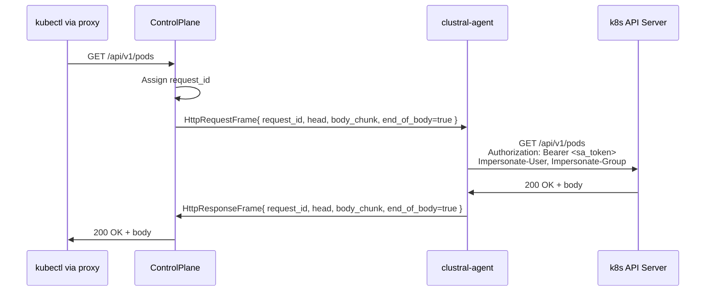

# Tunnel Lifecycle

The Clustral agent holds a single persistent gRPC bidirectional stream to the ControlPlane. Every kubectl request is multiplexed over that stream. This page traces the tunnel from first boot through graceful shutdown.

## Overview

The tunnel is the only transport between your cluster and the Clustral control plane. It is outbound-only from the agent's perspective — the agent has no inbound ports and no inbound firewall rules are required on the cluster. mTLS and an RS256 JWT authenticate every connection; the JWT carries the cluster identity and a token version that the ControlPlane increments on explicit revocation.

## Bootstrap

The agent's first boot requires a one-time bootstrap token issued by the ControlPlane when an admin registers the cluster. The token is single-use — it's consumed atomically on `RegisterAgent` and cannot be replayed.

The client certificate is signed by the Clustral CA. Its validity is controlled by `CertificateAuthority:ClientCertValidityDays` (default 395 days). The JWT has a separate, shorter TTL and is renewed independently — certificate renewal and token renewal are two different RPCs (`RenewCertificate` and `RenewToken`).


If the agent loses its client certificate, its private key, or its JWT, it cannot reconnect. A new bootstrap token must be issued via `clustral clusters bootstrap <cluster>`. Back up `/etc/clustral/` or deploy the agent with persistent storage.


## Session open

Once the agent has mTLS credentials and a JWT, it opens the tunnel. The server side lives in `TunnelSessionManager` — a singleton in the ControlPlane that maps `clusterId → TunnelSession`. Each session wraps the live `IServerStreamWriter<TunnelServerMessage>` and a `ConcurrentDictionary` of pending HTTP request completions.

Stream authentication is belt and braces:

- **mTLS** proves the agent holds a CA-signed client certificate tied to the cluster.
- **RS256 JWT** carries the `clusterId` and `tokenVersion` claims. The ControlPlane's `AgentAuthInterceptor` verifies both on every RPC. If an admin revokes agent credentials, `tokenVersion` increments and the next request fails with `PermissionDenied`.

If a second agent pod connects for the same cluster (rolling deployment, split brain), `TunnelSessionManager` evicts the older session and keeps the newest one. `last_seen_at` on the `Cluster` record tracks stream liveness.

## Request multiplexing

The kubectl proxy handler on the ControlPlane takes each incoming HTTP request, wraps it in a `HttpRequestFrame`, and sends it through the session. The agent receives the frame, replays it as a local HTTP call to the cluster's API server, and streams the response back as one or more `HttpResponseFrame` messages tagged with the same `request_id`.

A single stream carries many concurrent requests. Each side dispatches frames into a goroutine (agent) or task (ControlPlane) keyed by `request_id`, and the multiplex is limited only by memory. The maximum time the ControlPlane waits for a response before returning `REQUEST_TIMEOUT` is `Proxy:TunnelTimeout` (default 2 minutes).

Per-credential rate limiting is applied before the request ever reaches the tunnel. Defaults match k8s client-go: 200-token bucket, 100 QPS refill, 50-request queue (see `Proxy:RateLimiting` in `appsettings.json`).

## Heartbeat and renewal

There is no separate heartbeat RPC. Stream-level health is the liveness signal — if the gRPC stream breaks, the agent is considered disconnected. The agent also sends periodic `ClusterService.UpdateStatus` calls (default `AGENT_HEARTBEAT_INTERVAL=30s`) to refresh `last_seen_at` and report the k8s API version discovered at startup.

The Kubernetes API version is discovered once at startup via `GET /version` on the local API server, not resent on every heartbeat. It's reported in the initial `AgentHello`.

Credential renewal runs in a separate goroutine that checks expiry every `AGENT_RENEWAL_CHECK_INTERVAL` (default 6h):

| Credential | Renewal RPC | Renew if expiry within |
|---|---|---|
| mTLS client certificate | `ClusterService.RenewCertificate` | `AGENT_CERT_RENEW_THRESHOLD` (default 720h / 30 days) |
| RS256 tunnel JWT | `ClusterService.RenewToken` | `AGENT_JWT_RENEW_THRESHOLD` (default 168h / 7 days) |

Renewal is in-band — it uses the same mTLS + JWT auth as any other RPC. `RenewToken` does not increment `tokenVersion`, so the old and new JWTs are both valid during the overlap window.

## Graceful close

On `SIGTERM`, the agent stops dispatching new frames, closes the stream cleanly, and exits. The ControlPlane sees the stream close, removes the session from `TunnelSessionManager`, and marks the cluster status as `DISCONNECTED`. The next kubectl proxy request for that cluster returns `AGENT_NOT_CONNECTED` with a 503.

In-flight requests are not drained today — they fail with a stream-closed error. Graceful drain is tracked as a pending enhancement in `src/clustral-agent/CLAUDE.md`.

## Reconnection

On any stream error, the agent enters the `Reconnecting` state and backs off with exponential + jitter. Defaults:

| Setting | Default |
|---|---|
| `AGENT_RECONNECT_INITIAL_DELAY` | `2s` |
| `AGENT_RECONNECT_MAX_DELAY` | `60s` |
| `AGENT_RECONNECT_BACKOFF_MULTIPLIER` | `2.0` |
| `AGENT_RECONNECT_MAX_JITTER` | `5s` |

Error-specific handling:

- **`Unauthenticated`** — agent immediately triggers JWT renewal, then reconnects. Covers the case where the JWT expired between renewal checks.
- **`PermissionDenied`** — agent stops. This status means the tunnel JWT was revoked (tokenVersion bumped) or the cluster was deregistered. Reconnecting would spin forever; the operator must re-bootstrap.
- **Any other error** — normal backoff loop.

## What can go wrong

| Event | What users see | Recovery |
|---|---|---|
| Agent pod restart | `kubectl` hangs, then returns `AGENT_NOT_CONNECTED` | Automatic reconnect; seconds. |
| Network partition | Same as above | Automatic reconnect when network returns. |
| mTLS cert expired | Agent fails at TLS handshake, loops with backoff | Re-run bootstrap with a new token: `clustral clusters bootstrap <cluster>`. |
| Tunnel JWT expired | Gateway rejects at stream open; agent renews and retries | Automatic if the expiry is caught within the renewal threshold. |
| Tunnel JWT revoked (admin action) | Agent receives `PermissionDenied` and stops | Issue a new bootstrap token and redeploy the agent. |
| Cluster deregistered | Same as above | Re-register the cluster in the Web UI or via `clustral clusters register`. |
| Bootstrap token replayed | `RegisterAgent` fails with `TOKEN_ALREADY_USED` | Request a new bootstrap token. Each token is single-use. |

## See also

- [Authentication Flows](authentication-flows.md) — the kubeconfig JWT and internal JWT chain that ends at the tunnel.
- [Network Map](network-map.md) — the ports, directions, and TLS terminations involved.
- [Agent Deployment](../agent-deployment/README.md) — how to install the agent via Helm.
- [mTLS Bootstrap](../agent-deployment/mtls-bootstrap.md) — details on the bootstrap token exchange and CA trust anchor.
