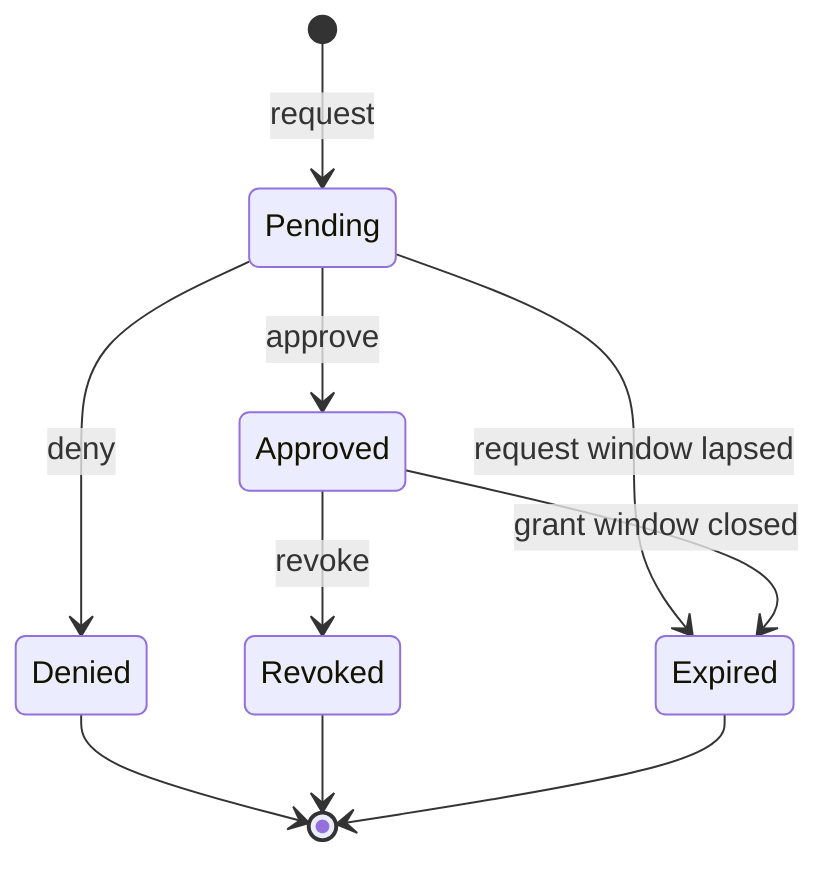

# `clustral access`

Manage the full lifecycle of just-in-time (JIT) access requests: open a request, watch its status, approve or deny as a reviewer, and revoke an active grant.

## Synopsis

```
clustral access request  --cluster <name> --role <name> [options]
clustral access list     [--status <state>] [--active]
clustral access approve  <request-id>
clustral access deny     <request-id> --reason "<text>"
clustral access revoke   <request-id> [--reason "<text>"]
```

`list` has alias `ls`.

## Description

An access request moves through a small state machine. A user files a request with a reason and a requested duration. A reviewer either approves or denies it. An approved request becomes an active grant until its window closes or a reviewer revokes it.



Grants are enforced at the proxy: a live `kubectl` session loses authorization on its next request once the grant expires or is revoked. Existing in-flight streams (e.g., `kubectl logs -f`) terminate when the credential is next validated. To also invalidate the live kubeconfig JWT immediately, revoke via the `/api/v1/auth/revoke-by-token` API (see [API Reference](../api-reference/README.md)).

## Subcommands

### `clustral access request`

File a new access request.

| Flag | Description | Default |
|---|---|---|
| `--cluster <name>` | Cluster name or GUID. Required. | — |
| `--role <name>` | Role name to request. Required. | — |
| `--duration <d>` | Requested grant duration (`8H`, `30M`, `1D`, or ISO 8601 `PT8H`). | `8H` |
| `--reason <text>` | Human justification shown to reviewers. | — |
| `--reviewer <email>` | Suggested reviewer email. Repeatable. | — |
| `--wait` | Block and poll until the request is approved or denied. | `false` |
| `--insecure` | Skip TLS verification. | `false` |

### `clustral access list` (alias `ls`)

List your own access requests.

| Flag | Description | Default |
|---|---|---|
| `--status <state>` | Filter by status: `Pending`, `Approved`, `Denied`, `Expired`, `Revoked`. | all |
| `--active` | Show only currently-active grants (approved, not expired, not revoked). | `false` |
| `--json` | Emit machine-readable JSON. | `false` |
| `--insecure` | Skip TLS verification. | `false` |

### `clustral access approve <request-id>`

Approve a pending request. Requires approval authority on the cluster or role.

### `clustral access deny <request-id> --reason "<text>"`

Deny a pending request. `--reason` is required and is surfaced in the audit log and in the requester's CLI output.

### `clustral access revoke <request-id> [--reason "<text>"]`

Revoke an approved grant before its window closes. `--reason` is optional but recommended — it is recorded on the audit event.

## Examples

### Alice requests access

```bash
$ clustral access request \
    --cluster prod-us-east \
    --role sre \
    --duration 4H \
    --reason "pager — payments p99 latency spike"

✓ Access request submitted
  Request ID   a3f72c18...
  Role         sre
  Cluster      prod-us-east
  Duration     PT4H
  Expires      18:42:03
```

### Bob approves it

```bash
$ clustral access list --status Pending
ID        ROLE  CLUSTER       STATUS       REQUESTER           CREATED  EXPIRES
a3f72c18  sre   prod-us-east  ● Pending    alice@example.com   2m ago   04-14 18:42

$ clustral access approve a3f72c18-6a94-4a05-8e2c-7e1b07c1b8a2
✓ Approved request a3f72c18...
  User     alice@example.com
  Role     sre
  Cluster  prod-us-east
  Expires  2026-04-14 18:42:03 +02:00
```

### Alice uses the grant

```bash
$ clustral kube login prod-us-east
✓ Kubeconfig updated
  Context   clustral-prod-us-east
  Expires   2026-04-14 18:42:03 +02:00

$ kubectl -n payments logs deploy/checkout --tail=50
...
```

### Revoke an active grant

```bash
$ clustral access revoke a3f72c18-6a94-4a05-8e2c-7e1b07c1b8a2 \
    --reason "incident resolved"
✗ Revoked grant a3f72c18...
  User     alice@example.com
  Role     sre
  Cluster  prod-us-east
  Reason   incident resolved
```

### Deny with a reason

```bash
$ clustral access deny a3f72c18-6a94-4a05-8e2c-7e1b07c1b8a2 \
    --reason "please pair with on-call instead"
✗ Denied request a3f72c18...
  Reason  please pair with on-call instead
```

### Script-friendly listing

```bash
$ clustral access list --active --json | jq '.requests[] | {cluster: .clusterName, role: .roleName, expiresAt: .grantExpiresAt}'
{
  "cluster": "prod-us-east",
  "role": "sre",
  "expiresAt": "2026-04-14T16:42:03Z"
}
```

### Block until approval

```bash
$ clustral access request --cluster prod-us-east --role sre --duration 2H --wait
✓ Access request submitted
  Request ID   b2e19d44...
  ...
  ● Waiting for approval...
✓ Access approved
  Approved by   bob@example.com
  Grant expires 2026-04-14 20:19:44 +02:00

  Run clustral kube login prod-us-east to connect.
```

### Troubleshooting

| Symptom | Cause | Fix |
|---|---|---|
| `PENDING_REQUEST_EXISTS` | You already have a pending request for this cluster/role. | `clustral access list --status Pending` to find it. |
| `STATIC_ASSIGNMENT_EXISTS` | You already have the role statically — no JIT needed. | Skip the request; run `clustral kube login <cluster>`. |
| `GRANT_NOT_APPROVED` from `kubectl` | Your grant was created with a scheduled start that has not elapsed, or was never approved. | `clustral access list --active` to verify; ask a reviewer to approve. |
| `NOT_AUTHORIZED_TO_APPROVE` | You are not on the reviewer list for the cluster or role. | Ask a reviewer with authority; check cluster/role configuration. |
| `REQUEST_NOT_FOUND` on approve/deny/revoke | Wrong ID, or the request belongs to a cluster you cannot see. | Use `clustral access list` (without filters) to see your visible requests. |

## Exit codes

| Code | Meaning |
|---|---|
| 0 | Success (including `--wait` → approved). |
| 1 | Generic error, or `--wait` ended with Denied/Expired. |

## See also

- [`clustral kube login`](kube-login.md) — mint the kubeconfig credential once the grant is active.
- [Error Reference: access-request codes](../errors/README.md) — full list of `CAR*` audit codes.
- [Authentication Flows](../architecture/authentication-flows.md) — how grants gate the proxy path.
- [`clustral audit`](../cli-reference/README.md) — query audit events for approvals, denials, and revocations.
