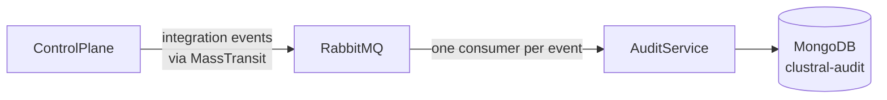

# Audit Log

Every authentication, authorization decision, access-request state change, credential issuance and revocation, cluster registration, and proxy error is logged to a dedicated AuditService and queryable via REST.

## Overview

Audit data lives in a separate MongoDB database (`clustral-audit` by default) so it can be scaled and retained independently of operational data. The ControlPlane publishes integration events to RabbitMQ on every significant state change; the AuditService consumes them, enriches with user email and cluster name, and persists one `AuditEvent` row per event.

The audit log is append-only by construction. `AuditEvent` has init-only properties, no state-transition methods, and no soft-delete flag. There is no update endpoint. Operators who need to purge data apply retention at the database layer (see [Retention](#retention)).


Audit data is security-sensitive. Before enabling any retention policy, confirm your organization's legal and compliance requirements (SOC 2, ISO 27001, HIPAA, GDPR) — many require a minimum retention of 1–7 years.


## Architecture



The ControlPlane never writes to the audit database directly. Every audit record comes from a MassTransit integration event consumed by a dedicated consumer in `src/Clustral.AuditService/Consumers/`. This keeps audit loosely coupled, survives AuditService downtime (RabbitMQ queues buffer events), and centralizes the persistence shape.

The AuditService exposes a REST API on `:5200`. The API Gateway proxies `/audit-api/*` requests to it and strips the prefix. Authentication is internal JWT only — direct access bypassing the gateway returns 401.

## Event schema

Every `AuditEvent` has the following fields.

| Field | Type | Meaning |
|---|---|---|
| `id` | GUID | Server-generated primary key |
| `code` | string | Teleport-style identifier: `[PREFIX][NUMBER][SEVERITY]` (e.g. `CAR002I`) |
| `event` | string | Short machine-friendly event name (e.g. `access_request.approved`) |
| `category` | string | Logical grouping — `AccessRequest`, `Credential`, `Cluster`, `Proxy`, `User`, `Role`, `Agent` |
| `severity` | enum | `Info`, `Warning`, or `Error` |
| `success` | bool | Whether the underlying operation succeeded |
| `time` | ISO-8601 UTC | When the source event occurred (not when it was persisted) |
| `userId` | GUID? | Actor (if applicable) |
| `userEmail` | string? | Actor email at the time of the event |
| `clusterId` | GUID? | Resource cluster (if applicable) |
| `clusterName` | string? | Cluster name at the time of the event |
| `resourceId` | GUID? | Secondary resource — credentialId, roleId, accessRequestId |
| `correlationId` | string? | Echoes `X-Correlation-Id` from the originating request |
| `message` | string | Human-readable summary |
| `metadata` | document | Event-specific fields (e.g. `grantDuration` on `AccessRequestApproved`) |

Event-code prefixes follow a fixed catalog defined in `src/Clustral.AuditService/Domain/EventCodes.cs`.

| Prefix | Domain |
|---|---|
| `CAR` | Access Requests |
| `CCR` | Credentials |
| `CCL` | Clusters |
| `CRL` | Roles |
| `CUA` | User Auth |
| `CAG` | Agent Auth |
| `CPR` | Proxy (kubectl) |

Severity suffix: `I` = Info, `W` = Warning, `E` = Error.

## Representative event catalog

The most commonly needed codes. For the full current list, query the audit endpoint with no filters and group by `code`, or read `src/Clustral.AuditService/Domain/EventCodes.cs`.

| Code | Category | What it records |
|---|---|---|
| `CCL001I` | Cluster | Cluster registered (new agent bootstrap successful) |
| `CCL002I` | Cluster | Agent connected (tunnel open) |
| `CCL003W` | Cluster | Agent disconnected |
| `CCL004I` | Cluster | Cluster deleted |
| `CCR001I` | Credential | Kubeconfig JWT issued |
| `CCR002I` | Credential | Credential revoked explicitly |
| `CCR003W` | Credential | Credential revocation denied |
| `CCR004W` | Credential | Credential issue failed |
| `CAR001I` | AccessRequest | Access request submitted |
| `CAR002I` | AccessRequest | Access request approved |
| `CAR003W` | AccessRequest | Access request denied |
| `CAR004I` | AccessRequest | Access grant revoked |
| `CAR005I` | AccessRequest | Access grant auto-expired |
| `CRL001I` | Role | Role created |
| `CRL002I` | Role | Role updated |
| `CRL003I` | Role | Role deleted |
| `CUA001I` | User | User synced from OIDC claims (first sign-in or claims changed) |
| `CUA002I` | User | Role assigned to user |
| `CUA003I` | User | Role unassigned from user |
| `CAG001W` | Agent | Agent authentication failed (bad cert, unknown cluster, revoked) |
| `CPR001I` | Proxy | kubectl proxy request completed |
| `CPR002W` | Proxy | kubectl proxy request denied |

## Querying audit events

`GET /audit-api/api/v1/audit` returns a paginated list. All filters are optional and compose with `AND`.

| Parameter | Type | Meaning |
|---|---|---|
| `category` | string | `AccessRequest`, `Credential`, `Cluster`, `Proxy`, `User`, `Role`, `Agent` |
| `code` | string | Exact event code (e.g. `CAR002I`) |
| `userId` | GUID | Actor |
| `userEmail` | string | Actor email (exact match) |
| `clusterId` | GUID | Resource cluster |
| `from` | ISO-8601 | Inclusive lower bound on `time` |
| `to` | ISO-8601 | Exclusive upper bound on `time` |
| `correlationId` | string | Trace a single request across events |
| `limit` | int | Page size (default 100, max 1000) |
| `cursor` | string | Opaque pagination token from the previous response |

Example — every credential event since 2026-01-01, through the gateway:

```bash
curl -H "Authorization: Bearer $(cat ~/.clustral/token)" \
  "https://clustral.example.com/audit-api/api/v1/audit?category=Credential&from=2026-01-01T00:00:00Z"
```

Example — every event tied to a single correlation ID (useful when debugging a user-reported failure):

```bash
curl -H "Authorization: Bearer $(cat ~/.clustral/token)" \
  "https://clustral.example.com/audit-api/api/v1/audit?correlationId=01J9XZK7QH3ZNW8G4V5YTQ8M1A"
```

A single event by id:

```bash
curl -H "Authorization: Bearer $(cat ~/.clustral/token)" \
  "https://clustral.example.com/audit-api/api/v1/audit/8f1a0f1a-6c3b-4a0a-a1c5-d5d6f8b7e6a2"
```

## CLI integration

The CLI wraps the REST API:

```bash
clustral audit                                         # last 100 events
clustral audit --category AccessRequest --limit 20
clustral audit --code CAR002I
clustral audit --user alice@example.com --from 2026-01-01
clustral audit --correlation-id 01J9XZK7QH3ZNW8G4V5YTQ8M1A
```

See the [CLI Reference](../cli-reference/README.md) for the full flag list and output format.

## Correlation

Every audit event carries `correlationId` matching the `X-Correlation-Id` header Clustral writes on every HTTP response. When debugging a failed operation, grab the correlation ID from the user's error message or response headers and filter the audit log by it to see the full event chain.

```bash
# User reports: "kubectl get pods failed with correlation ID 01J9XZ..."
clustral audit --correlation-id 01J9XZK7QH3ZNW8G4V5YTQ8M1A
```

A typical chain for a failed kubectl call reads: `CPR002W` (proxy denied) with a `reason` in metadata, optionally preceded by `CCR003W` or `CAR005I` if the credential was revoked or the underlying grant expired.

## Retention

The AuditService does not ship a built-in retention policy. Audit records accumulate indefinitely in `clustral-audit.audit_events`. Operators who need retention must apply it externally.

**Option 1 — MongoDB TTL index.** Apply a TTL index on `audit_events.{time}` with `expireAfterSeconds` matching your policy. MongoDB removes expired documents in the background.

```javascript
db.audit_events.createIndex(
  { time: 1 },
  { expireAfterSeconds: 63072000 }  // 2 years
)
```

**Option 2 — export and purge.** Run an external job that exports to cold storage (S3 + Athena, BigQuery, a SIEM), then deletes rows older than your retention window. Use this when you need to keep audit data beyond what is practical in MongoDB, or when your compliance framework requires immutable off-cluster storage.

A first-party retention policy is on the roadmap. Track the project's issue tracker for current status.

## What is not audited

- **Proxy request bodies.** Only metadata is captured: `method`, `path`, `statusCode`, `durationMs`, `clusterId`, `userId`, `credentialId`. Payload capture is on the roadmap.
- **Secret values.** Tokens, keys, and credential material never appear in audit records — only credential IDs and hashes.
- **Web UI navigation.** Audit records the operations the UI performs via the API, not page views.

Anything sensitive that is not in the table above is not currently written to the audit log. If you need an event that does not exist yet, publish a new integration event from the ControlPlane, add a code to `EventCodes`, and write a consumer — see the AuditService `CLAUDE.md` for the pattern.

## See also

- [mTLS and JWT Lifecycle](mtls-jwt-lifecycle.md) — what the credential events in this log actually represent.
- [CLI Reference](../cli-reference/README.md) — the `clustral audit` command.
- [API Reference](../api-reference/README.md) — every REST endpoint, including `/audit-api/api/v1/audit`.
- [Operator Guide — Troubleshooting](../operator-guide/troubleshooting.md) — using correlation IDs and audit queries to diagnose incidents.
