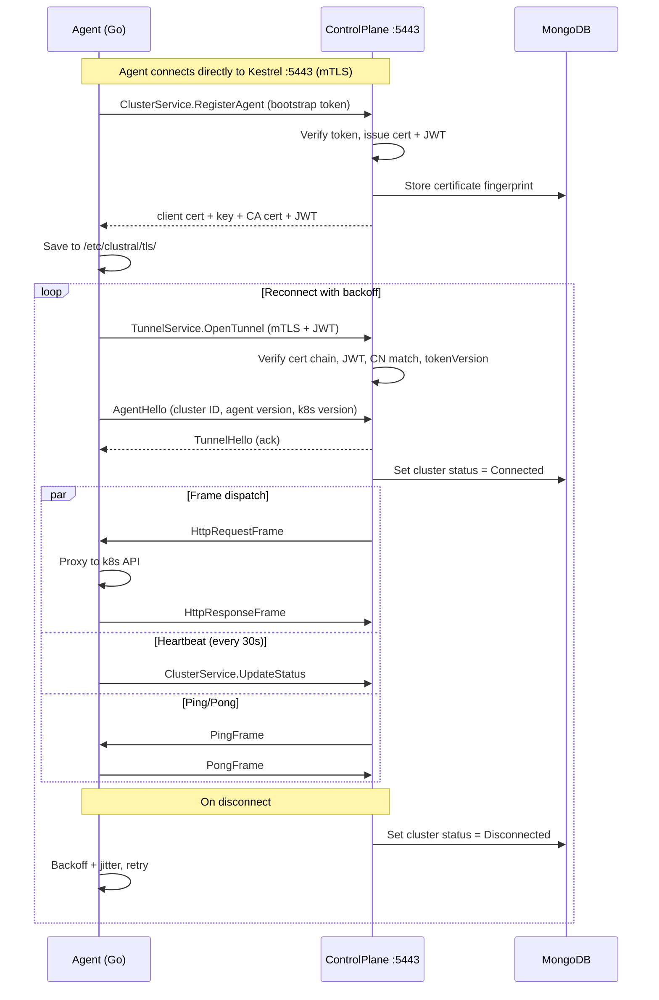

The Clustral Agent is a Go binary deployed into each Kubernetes cluster you want to manage through Clustral. It opens a persistent **outbound** gRPC connection to the ControlPlane, receives proxied `kubectl` requests over the tunnel, and forwards them to the local Kubernetes API server using impersonation headers.

## Key Properties

- **Outbound only** -- no inbound firewall rules, VPNs, or bastion hosts required
- **Small footprint** -- ~16MB static binary in an Alpine container
- **Automatic credential renewal** -- mTLS certificates and JWTs are renewed before expiry
- **Multi-value header support** -- the reason for the Go implementation (Go's `net/http` sends each `Impersonate-Group` as a separate HTTP header line, which Kubernetes requires)

## How It Works

1. On first boot, the agent exchanges a one-time bootstrap token for mTLS client certificates and a JWT via the `RegisterAgent` gRPC call.
2. The agent opens a persistent bidirectional gRPC stream (`OpenTunnel`) to the ControlPlane on `:5443` using mTLS + JWT.
3. When a user runs `kubectl`, the ControlPlane sends an `HttpRequestFrame` over the tunnel.
4. The agent translates `X-Clustral-Impersonate-*` headers to Kubernetes `Impersonate-*` headers, injects the ServiceAccount token, and forwards the request to the Kubernetes API server.
5. The response is sent back as an `HttpResponseFrame` over the tunnel.

## Startup Flow

```
main()
  +-- config.Load()                     Read AGENT_* env vars
  +-- [Bootstrap] if AGENT_BOOTSTRAP_TOKEN set:
  |     registerAgent()
  |       gRPC ClusterService.RegisterAgent
  |       Receives: client cert + key + CA cert + JWT
  |       Saves to /etc/clustral/tls/ + agent.jwt
  |
  +-- HasMTLSCredentials()?             Check client.crt, client.key, ca.crt, agent.jwt
  |     false -> error (needs bootstrap token)
  |
  +-- proxy.New()                       Create http.Client with SA token + CA cert
  +-- k8s.DiscoverVersion()             GET /version on k8s API (non-fatal)
  |
  +-- auth.NewJWTCredentials(jwt)       PerRPCCredentials with sync.RWMutex
  +-- auth.NewRenewalManager()          Goroutine: check cert/JWT expiry every 6h
  |
  +-- tunnel.NewManager().Run(ctx)      Reconnect loop (blocks until SIGTERM)
        +-- connectAndRun()             One tunnel session
              +-- grpc.NewClient         mTLS + PerRPCCredentials
              +-- OpenTunnel             mTLS + JWT
              +-- AgentHello / TunnelHello handshake
              +-- errgroup.Group:
                    +-- dispatchFrames   Recv requests, goroutine per request
                    +-- heartbeat        UpdateStatus every 30s
```

## Bootstrap Flow



## Credential Lifecycle

### Bootstrap (First Boot)

The agent starts with a one-time bootstrap token (from cluster registration in the Web UI). It calls `ClusterService.RegisterAgent` and receives:

- **Client certificate**: RSA 2048, 395-day validity, CN=agentId
- **Client key**: RSA private key
- **CA certificate**: for verifying the ControlPlane's server certificate
- **JWT**: RS256, 30-day validity, includes `tokenVersion`

All credentials are saved to disk. The bootstrap token is consumed and cannot be reused.

### Automatic Renewal

The `RenewalManager` runs a check every 6 hours:

| Credential | Renewal Threshold | Action |
|---|---|---|
| Client certificate | Expires within 30 days | `RenewCertificate` RPC issues a new cert (395 days) |
| JWT | Expires within 7 days | `RenewToken` RPC issues a new JWT (hot-swapped, no reconnect needed) |

### Error Recovery

| gRPC Status | Agent Behavior |
|---|---|
| `Unauthenticated` | Trigger immediate JWT renewal, then reconnect |
| `PermissionDenied` | Stop permanently (credentials revoked, no retry) |
| Connection lost | Exponential backoff with jitter, auto-reconnect |

## Configuration

All settings are configured via environment variables. No config files.

| Variable | Default | Description |
|---|---|---|
| `AGENT_CLUSTER_ID` | *(required)* | Cluster ID from registration |
| `AGENT_CONTROL_PLANE_URL` | *(required)* | gRPC endpoint, e.g. `https://host:5443` |
| `AGENT_BOOTSTRAP_TOKEN` | *(required, first boot)* | One-time bootstrap token |
| `AGENT_CREDENTIAL_PATH` | `/etc/clustral/agent.token` | Credential storage path |
| `AGENT_KUBERNETES_API_URL` | `https://kubernetes.default.svc` | Kubernetes API server URL |
| `AGENT_KUBERNETES_SKIP_TLS_VERIFY` | `false` | Skip k8s API TLS verification (dev only) |
| `AGENT_HEARTBEAT_INTERVAL` | `30s` | Heartbeat frequency |
| `AGENT_CERT_RENEW_THRESHOLD` | `720h` | Renew cert if expiry is within this |
| `AGENT_JWT_RENEW_THRESHOLD` | `168h` | Renew JWT if expiry is within this |
| `AGENT_RENEWAL_CHECK_INTERVAL` | `6h` | How often to check credential expiry |
| `AGENT_RECONNECT_INITIAL_DELAY` | `2s` | Initial reconnect backoff |
| `AGENT_RECONNECT_MAX_DELAY` | `60s` | Maximum reconnect backoff |
| `AGENT_RECONNECT_BACKOFF_MULTIPLIER` | `2.0` | Backoff multiplier |
| `AGENT_RECONNECT_MAX_JITTER` | `5s` | Maximum reconnect jitter |

## In-Cluster Authentication

The agent authenticates to the Kubernetes API using the pod's ServiceAccount token mounted at `/var/run/secrets/kubernetes.io/serviceaccount/token`. The token is re-read on each request to support kubelet's hourly rotation.

The CA certificate at `/var/run/secrets/kubernetes.io/serviceaccount/ca.crt` is loaded into the TLS config for verifying the Kubernetes API server's certificate.

### Required RBAC

The agent needs the `impersonate` verb on users, groups, and service accounts:

```bash
kubectl apply -f https://raw.githubusercontent.com/Clustral/clustral/main/src/clustral-agent/k8s/serviceaccount.yaml
kubectl apply -f https://raw.githubusercontent.com/Clustral/clustral/main/src/clustral-agent/k8s/clusterrole.yaml
kubectl apply -f https://raw.githubusercontent.com/Clustral/clustral/main/src/clustral-agent/k8s/clusterrolebinding.yaml
```
