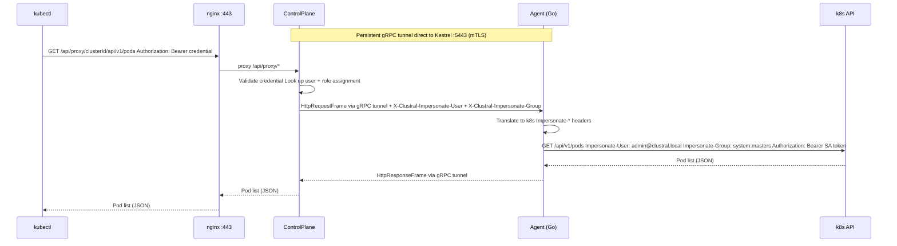

The Clustral tunnel is a persistent, bidirectional gRPC stream between each agent and the ControlPlane. All `kubectl` traffic is multiplexed over this stream, eliminating the need for inbound firewall rules on the cluster side.

## Protocol Overview

The tunnel uses `TunnelService.OpenTunnel`, a bidirectional streaming RPC. The agent initiates the connection, and both sides exchange frames asynchronously.

```
Agent                                     ControlPlane
  |                                           |
  |-- OpenTunnel (mTLS + JWT) ------------->  |
  |-- AgentHello (clusterId, versions) ---->  |
  |  <-- TunnelHello (ack) ---------------   |
  |                                           |
  |  <-- HttpRequestFrame ----------------   |  <-- kubectl (via nginx)
  |-- HttpResponseFrame ------------------>  |  --> kubectl response
  |                                           |
  |  <-- PingFrame -----------------------   |
  |-- PongFrame -------------------------->  |
  |                                           |
  |-- UpdateStatus (heartbeat, 30s) ------>  |
```

## Frame Types

### Client to Server (Agent to ControlPlane)

| Frame | Purpose |
|---|---|
| `AgentHello` | Handshake: sends cluster ID, agent version, and Kubernetes API version |
| `HttpResponseFrame` | Response to a proxied kubectl request |
| `PongFrame` | Reply to a PingFrame (keepalive) |

### Server to Client (ControlPlane to Agent)

| Frame | Purpose |
|---|---|
| `TunnelHello` | Handshake acknowledgement |
| `HttpRequestFrame` | Proxied kubectl request (method, path, headers, body) |
| `PingFrame` | Keepalive ping |

## Handshake

When the tunnel opens, the agent sends an `AgentHello` containing:

- **Cluster ID** -- identifies which cluster this agent represents
- **Agent version** -- reported in cluster listings, compared for version mismatch warnings
- **Kubernetes version** -- discovered once at startup via `GET /version` on the k8s API

The ControlPlane responds with a `TunnelHello` and sets the cluster status to `Connected` in the database.

## Kubectl Request Flow



When a user runs a `kubectl` command:

1. `kubectl` sends the request to nginx `:443` using the kubeconfig credential.
2. nginx proxies the request to the ControlPlane on `:5100`.
3. The ControlPlane validates the bearer token via `ProxyAuthService`.
4. `ImpersonationResolver` determines the user's Kubernetes groups from role assignments or JIT grants.
5. The ControlPlane constructs an `HttpRequestFrame` containing:
   - HTTP method, path, and query string
   - Request headers (with `X-Clustral-Impersonate-User` and `X-Clustral-Impersonate-Group` added)
   - Request body (if any)
6. The frame is sent to the agent over the gRPC tunnel.
7. The agent translates `X-Clustral-Impersonate-*` headers to Kubernetes `Impersonate-*` headers.
8. The agent injects the ServiceAccount token and forwards the request to the Kubernetes API.
9. The Kubernetes API response is wrapped in an `HttpResponseFrame` and sent back.
10. The ControlPlane returns the response to `kubectl` via nginx.

## Impersonation Header Translation

The agent translates Clustral-specific headers to Kubernetes impersonation headers:

| Clustral Header | Kubernetes Header |
|---|---|
| `X-Clustral-Impersonate-User` | `Impersonate-User` |
| `X-Clustral-Impersonate-Group` | `Impersonate-Group` |

Each `X-Clustral-Impersonate-Group` value is sent as a **separate HTTP header line** using Go's `Header.Add()`. This is critical because the Kubernetes API requires multi-value impersonation headers as separate lines -- comma-separated values are rejected.

This behavior was the primary motivation for rewriting the agent in Go. .NET's `HttpClient` combines multi-value headers into a single comma-separated line, which breaks the Kubernetes Impersonation API.

## Connection Lifecycle

### Reconnection

If the tunnel connection drops, the agent reconnects with exponential backoff:

| Setting | Default |
|---|---|
| Initial delay | 2 seconds |
| Maximum delay | 60 seconds |
| Backoff multiplier | 2.0x |
| Maximum jitter | 5 seconds |

### Heartbeat

The agent sends a `ClusterService.UpdateStatus` RPC every 30 seconds (configurable via `AGENT_HEARTBEAT_INTERVAL`). This serves as both a liveness signal and a cluster status update.

### Ping/Pong

The ControlPlane sends `PingFrame` messages periodically. The agent responds with `PongFrame` to confirm the tunnel is alive at the application level.

### Disconnect Handling

When a tunnel disconnects:

1. The ControlPlane sets the cluster status to `Disconnected` in MongoDB.
2. The `TunnelSessionManager` removes the session.
3. Any pending kubectl requests for that cluster receive a timeout error.
4. The agent begins reconnection with backoff.

## Session Management

The `TunnelSessionManager` is a singleton in the ControlPlane that maps each cluster ID to an active `TunnelSession`. The session holds:

- The live gRPC `IServerStreamWriter` for sending frames to the agent
- A `ConcurrentDictionary` of pending HTTP request completions (correlated by request ID)

When the kubectl proxy handler receives a request, it calls `TunnelSessionManager.GetSession(clusterId)` to find the active tunnel and dispatch the `HttpRequestFrame`.

## Authentication

Every tunnel connection requires two credentials:

1. **mTLS client certificate** -- the agent presents its client certificate during the TLS handshake. The ControlPlane verifies the certificate chain against the CA that issued it.
2. **RS256 JWT** -- sent as gRPC metadata on every RPC call. The `AgentAuthInterceptor` validates the JWT signature, expiry, and `tokenVersion` (to support instant revocation).

Both credentials are obtained during the bootstrap flow and renewed automatically by the agent's `RenewalManager`.
