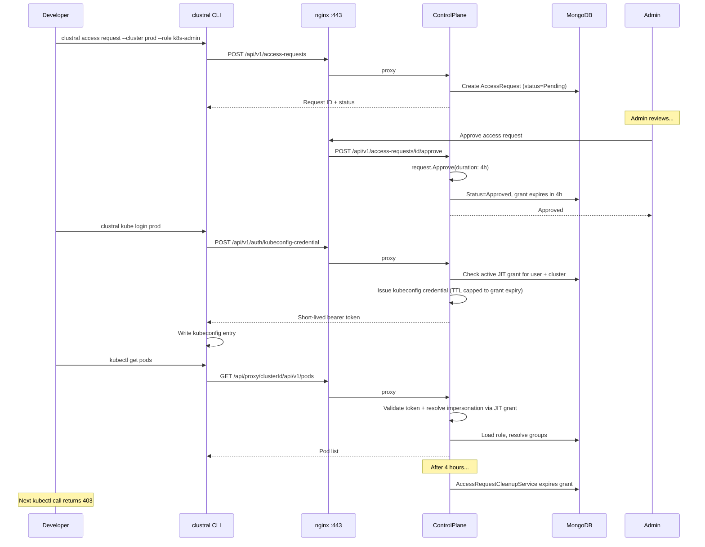

Clustral supports just-in-time (JIT) access requests that grant temporary, role-based access to Kubernetes clusters. Instead of permanent role assignments, users request access for a specific duration and an administrator approves or denies the request.

## Request Access

```bash
# Request access (cluster and role accept names or GUIDs)
clustral access request --cluster prod --role k8s-admin

# Request with a custom duration
clustral access request --cluster prod --role read-only --duration 2H
clustral access request --cluster prod --role read-only --duration PT2H

# Wait for approval (polls until approved, denied, or timeout)
clustral access request --cluster prod --role k8s-admin --wait
```

### Options

| Option | Description |
|---|---|
| `--cluster` | Target cluster name or GUID (required) |
| `--role` | Requested role name or GUID (required) |
| `--duration` | Requested access duration. Shorthand (`2H`, `30M`, `1D`) or ISO 8601 (`PT2H`). The approver may override this |
| `--reason` | Reason for the access request (optional, shown to the approver) |
| `--wait` | Poll the ControlPlane until the request is approved or denied |

## List Access Requests

```bash
clustral access list
clustral access ls

# JSON output for scripting
clustral access list -o json

# Filter pending requests
clustral access list -o json | jq '.requests[] | select(.status == "Pending")'
```

## Approve a Request

Administrators can approve pending access requests:

```bash
clustral access approve <request-id>

# Approve with a custom duration (overrides the requester's ask)
clustral access approve <request-id> --duration 4H
```

On approval, the access grant becomes active and the requester can use `clustral kube login` to obtain a credential scoped to the granted role.

## Deny a Request

```bash
# Denial requires a reason
clustral access deny <request-id> --reason "not authorized for production"
```

## Revoke an Active Grant

Revoke a previously approved access grant before it expires:

```bash
clustral access revoke <request-id>
```

Revoking an active grant immediately invalidates any kubeconfig credentials issued under that grant. The next `kubectl` command returns `403`.

## Access Request Lifecycle



An access request moves through the following states:

```
              request
                |
                v
           +---------+
           | Pending  |
           +---------+
          /           \
    approve            deny
        /               \
       v                 v
  +---------+       +---------+
  | Approved |       | Denied  |
  +---------+       +---------+
       |
   revoke / expire
       |
       v
  +---------+
  | Revoked  |
  | Expired  |
  +---------+
```

### State Transitions

| From | To | Trigger |
|---|---|---|
| Pending | Approved | Admin runs `clustral access approve` |
| Pending | Denied | Admin runs `clustral access deny` |
| Approved | Revoked | Admin runs `clustral access revoke` |
| Approved | Expired | Grant duration elapses (automatic, via background cleanup service) |

### How JIT Access Works with kubectl

1. A developer requests access: `clustral access request --cluster prod --role k8s-admin`
2. An administrator approves: `clustral access approve <id>`
3. The developer issues a credential: `clustral kube login prod`
   - The credential TTL is capped to the grant's remaining duration
4. `kubectl` works normally until the grant expires
5. After expiry, the next `kubectl` command returns `403: No role assigned for this cluster`

### Impersonation Resolution

When a `kubectl` request arrives, the ControlPlane resolves the user's access using a fallback chain:

1. **Static role assignments** -- permanent per-cluster role bindings (configured in the Web UI)
2. **JIT access grants** -- active, non-expired approved requests

If a JIT grant is found, the role's Kubernetes groups are sent as `Impersonate-Group` headers through the tunnel to the agent, which forwards them to the Kubernetes API server.
