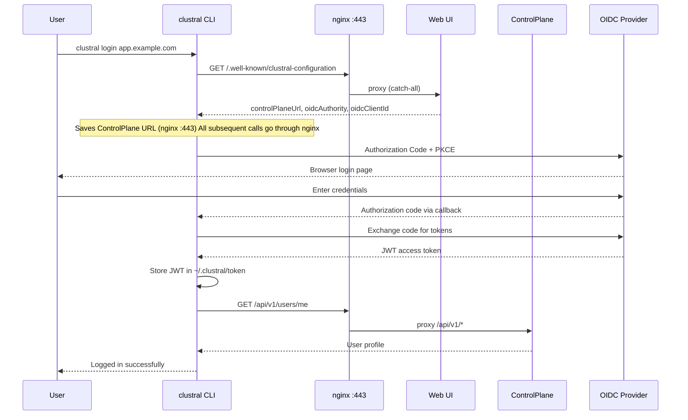

## clustral login

Authenticates with a Clustral ControlPlane using the OIDC Authorization Code flow with PKCE (Proof Key for Code Exchange). No client secret is required.

```bash
# First login -- discovers configuration and authenticates
clustral login app.example.com

# Re-authenticate (force new token even if session is valid)
clustral login --force

# Login to a specific account within the current profile
clustral login --account dev@corp.com

# Allow self-signed or invalid TLS certificates (development only)
clustral login --insecure
```

### Options

| Option | Description |
|---|---|
| `controlplane-url` | URL of the Clustral platform (positional argument, required on first login) |
| `--force` | Force re-authentication even if the current session is still valid |
| `--account` | Login as a specific account identity |
| `--insecure` | Skip TLS certificate verification (development environments only) |
| `--authority` | Override the OIDC authority URL |
| `--client-id` | Override the OIDC client ID (default: `clustral-cli`) |
| `--scopes` | Override the OIDC scopes (default: `openid email profile`) |
| `--port` | Override the local callback port (default: `7777`) |

### What Happens During Login

1. The CLI sends a `GET /.well-known/clustral-configuration` request to the provided URL (through nginx) to discover the ControlPlane URL and OIDC settings.
2. A PKCE code verifier and challenge are generated (SHA-256, base64url-encoded).
3. A random state parameter is generated for CSRF protection.
4. Your default browser opens to the OIDC provider's login page.
5. A local HTTP server starts on `127.0.0.1:7777` to receive the callback.
6. After you authenticate, the OIDC provider redirects back with an authorization code.
7. The CLI exchanges the authorization code for a JWT access token.
8. The token is stored in `~/.clustral/accounts/{email}.token` (within the active profile).
9. The CLI fetches your user profile from the ControlPlane to confirm the login.

### Authentication Flow



### Login Output

After a successful login, the CLI displays a profile summary:

```
> Profile URL:        http://app.example.com
  Logged in as:       Admin User
  Email:              admin@clustral.local
  Kubernetes:         enabled
  CLI version:        v0.1.0
  Roles:              k8s-admin
  Clusters:           production, staging
  Access:
    production               → k8s-admin
    staging                  → k8s-viewer
  Valid until:        2026-04-06 03:41:32 +0200 [valid for 3h16m]
```

### Auto-Login

When a session expires during an interactive command, the CLI prompts you to re-authenticate:

```
Session expired. Login again? [Y/n]
```

In non-interactive environments (CI/CD), the CLI exits with an error code instead.

## clustral logout

Signs out by revoking all credentials, removing kubeconfig contexts, and clearing stored tokens.

```bash
clustral logout
```

Logout performs the following:

1. Revokes all active kubeconfig credentials on the ControlPlane.
2. Removes all `clustral-*` contexts from `~/.kube/config`.
3. Deletes the stored JWT from `~/.clustral/accounts/`.

> Logout works even when the ControlPlane is unreachable. Local state is always cleaned up regardless of network connectivity.
