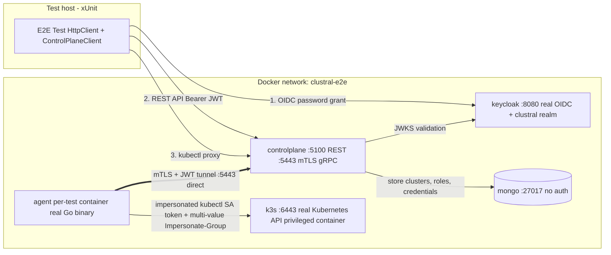
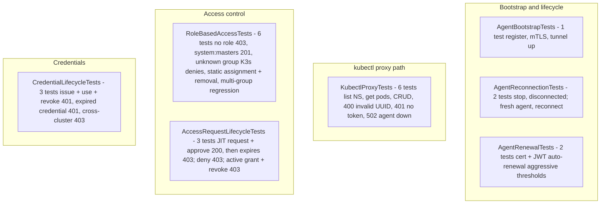

Clustral has three testing layers that run independently. Every new feature must include tests.

## Running tests

```bash
# Unit + integration (.NET — requires Docker for Testcontainers)
dotnet test Clustral.slnx --filter "Category!=E2E"

# Go agent (race detector enabled)
cd src/clustral-agent && go test -race ./...

# End-to-end (slow — full Docker stack)
dotnet test src/Clustral.E2E.Tests
```

## Unit tests

Unit test projects live alongside each `src/` project with a `*.Tests` suffix.

Requirements:
- Use **FluentAssertions** for all assertions (`.Should().Be(...)`, not `Assert.Equal`)
- Use **ITestOutputHelper** for xUnit test output, not `Console.WriteLine`

## Integration tests

Integration tests live in `src/Clustral.ControlPlane.Tests/Integration/` and use:

- **Testcontainers** for MongoDB -- a real database instance is spun up in Docker
- **WebApplicationFactory** for the ASP.NET Core test server

Do not mock the database. Docker must be running to execute integration tests.

### gRPC integration tests

`GrpcClusterServiceTests`, `GrpcAuthServiceTests`, and `GrpcMtlsTests` test all gRPC endpoints using `Grpc.Net.Client` against the test server. They cover:

- Cluster registration, listing, get, status update, deregistration
- Credential issuance, validation, rotation, and revocation
- mTLS bootstrap and bootstrap token single-use enforcement

### CLI integration tests

`CliIntegrationTests` verify that CLI wire types deserialize correctly against the real ControlPlane API.

## End-to-end tests

End-to-end tests live in `src/Clustral.E2E.Tests/` and orchestrate the full production stack:

- MongoDB
- Keycloak (OIDC provider)
- K3s (Kubernetes)
- ControlPlane (built from Dockerfile)
- Real Go agent (built from Dockerfile)

All components run on a shared Docker network. Tests exercise the full production path including the gRPC tunnel and multi-value impersonation header forwarding.

E2E tests are tagged with `[Trait("Category", "E2E")]` so the standard `dotnet test --filter "Category!=E2E"` command skips them. They require Docker with privileged container support (K3s needs it).

## E2E Test Architecture

Every E2E test runs against the real production binaries on a shared Docker network. There are no mocks, no in-process shortcuts, no test-only auth handlers. Keycloak issues real OIDC tokens, the ControlPlane validates real JWTs, and the Go agent forwards real multi-value impersonation headers to a real Kubernetes API.



### E2E Test Coverage



## Web UI tests

The Web UI uses:

- **Vitest** for unit tests (`bun test`)
- **Playwright** for end-to-end tests (`bun e2e`)

## Test coverage by component

| Component | Unit | Integration | E2E |
|---|---|---|---|
| ControlPlane | Required | Required (Testcontainers + WebApplicationFactory) | For cross-component changes |
| CLI | Required | Required | For cross-component changes |
| SDK | Required | Required | For cross-component changes |
| Agent (Go) | Required (`go test -race`) | -- | For tunnel/proxy changes |
| Web UI | Optional (Vitest) | -- | Optional (Playwright) |
