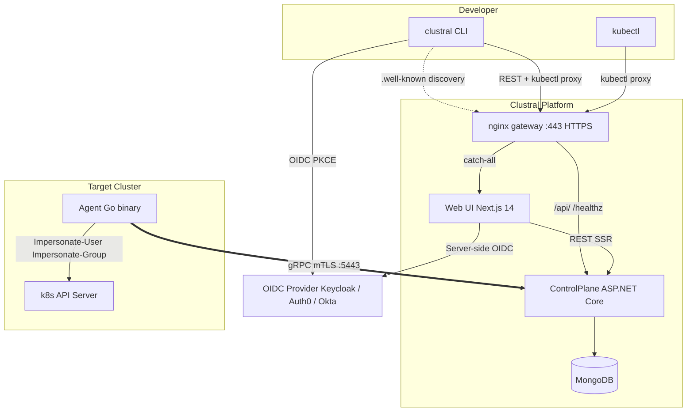

## Architecture

Clustral consists of five main components that work together to provide secure, tunneled Kubernetes access.

## Components

| Component        | Stack                                       | Description                                     |
|------------------|---------------------------------------------|-------------------------------------------------|
| **nginx**        | nginx 1.27                                  | Unified gateway -- TLS termination, routing      |
| **Web UI**       | Next.js 14, React 18, TypeScript, Tailwind  | Dashboard, server-side OIDC via NextAuth        |
| **ControlPlane** | ASP.NET Core, MongoDB                       | REST + gRPC server, kubectl tunnel proxy        |
| **Agent**        | Go 1.23, gRPC, 16 MB static binary          | Deployed per cluster, tunnels kubectl traffic   |
| **CLI**          | .NET NativeAOT, System.CommandLine          | `clustral login` / `clustral kube login`        |

## Key flows

- **`clustral login`** -- discovers the ControlPlane URL and OIDC settings via the Web UI's `/.well-known/clustral-configuration` endpoint (through nginx), then runs the OIDC Authorization Code + PKCE flow and stores the JWT locally.
- **`clustral kube login`** -- exchanges the stored token for a short-lived kubeconfig entry that routes `kubectl` traffic through the ControlPlane tunnel.
- **Agent tunnel** -- the agent opens a persistent outbound gRPC stream directly to the ControlPlane (mTLS + JWT, bypassing nginx). `kubectl` traffic is multiplexed over this stream, so no inbound firewall rules are needed on the cluster side.
- **JIT access requests** -- users request time-limited access to a cluster with a specific role. Admins approve or deny via the CLI or Web UI. Approved grants automatically expire when the time window closes.

## Security model

| Layer | Mechanism |
|---|---|
| External traffic | TLS termination on nginx :443 (HTTPS) |
| User authentication | OIDC JWT from any provider, routed through nginx |
| kubectl credentials | Short-lived bearer tokens (SHA-256 hashed, never stored raw) |
| Agent authentication | mTLS client certificate (RSA 2048, 395 days) + RS256 JWT (30 days) |
| Agent credential revocation | `tokenVersion` increment invalidates all agent JWTs instantly |
| Agent to k8s API | In-cluster ServiceAccount token + Kubernetes Impersonation API |
| Tunnel transport | gRPC over mTLS, agents connect directly to Kestrel :5443 |
| Rate limiting | Per-credential token bucket (100 QPS sustained, 200 burst) |

## Next steps

- [Installation](/docs/getting-started/installation) -- set up the development environment
- [Quickstart](/docs/getting-started/quickstart) -- authenticate and run your first `kubectl` command
- [Configuration](/docs/getting-started/configuration) -- CLI profiles, accounts, and config files
